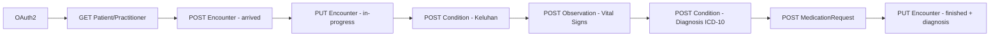
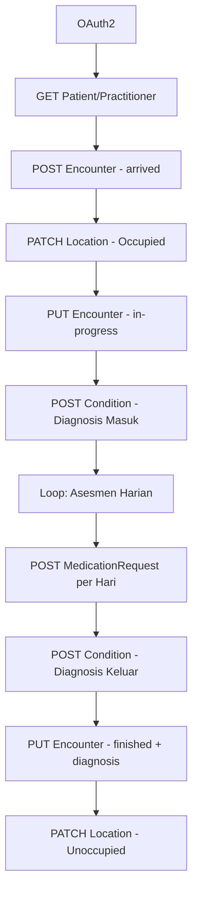
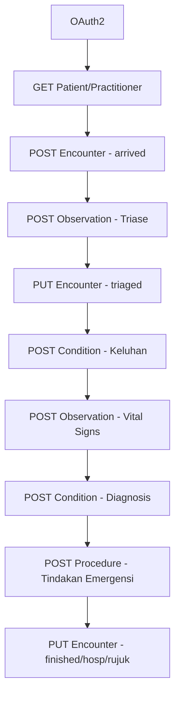
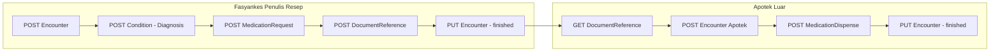

# Dokumentasi API SATUSEHAT - Alur Pelayanan

Dokumentasi ini berisi daftar endpoint API SATUSEHAT untuk integrasi data pelayanan kesehatan berdasarkan Postman Collection resmi dari Kemenkes RI.

## Informasi Umum

### Base URL
- **Auth URL**: `{{auth_url}}` - URL untuk otentikasi OAuth2
- **Base URL**: `{{base_url}}` - URL API SATUSEHAT
- **Private Host**: `{{privateHost}}` - URL untuk DICOM Router (Radiologi)

### Variabel Environment yang Diperlukan
| Variabel | Keterangan |
|----------|------------|
| `Org_id` | ID Organisasi Fasyankes |
| `Patient_id` | ID Pasien (IHS Number) |
| `Practitioner_id` | ID Tenaga Kesehatan (IHS Number) |
| `Encounter_id` | ID Kunjungan |
| `Location_id` | ID Lokasi/Ruangan |

---

## Daftar Isi

1. [Pelayanan Rawat Jalan](#1-pelayanan-rawat-jalan)
2. [Pelayanan Rawat Inap](#2-pelayanan-rawat-inap)
3. [Pelayanan IGD](#3-pelayanan-igd)
4. [Pelayanan Farmasi](#4-pelayanan-farmasi)

---

## 1. Pelayanan Rawat Jalan

**Referensi**: Playbook Modul Rawat Jalan V6.1

### Alur Proses

```
OAuth2 → Struktur Organisasi → Cari Pasien/Nakes → Pendaftaran → Anamnesis →
Pemeriksaan Fisik → Pemeriksaan Penunjang → Diagnosis → Tindakan →
Tatalaksana → Prognosis → RTL → Resume Medis → Selesai
```

### A. Autentikasi (OAuth2)

| No | Method | Endpoint | Deskripsi |
|----|--------|----------|-----------|
| 1 | POST | `{{auth_url}}/accesstoken?grant_type=client_credentials` | Generate Access Token |

### B. Struktur Organisasi dan Lokasi

| No | Method | Endpoint | Deskripsi |
|----|--------|----------|-----------|
| 1 | POST | `{{base_url}}/Organization` | Buat organisasi (UKP, Kefarmasian, Lab) |
| 2 | POST | `{{base_url}}/Organization` | Buat organisasi Poli |
| 3 | POST | `{{base_url}}/Location` | Buat lokasi Poli (Ruang) |
| 4 | POST | `{{base_url}}/Organization` | Buat organisasi Farmasi/Apotek |
| 5 | POST | `{{base_url}}/Location` | Buat lokasi Farmasi/Apotek |

### C. Mencari Data Pasien dan Nakes

| No | Method | Endpoint | Deskripsi |
|----|--------|----------|-----------|
| 1 | GET | `{{base_url}}/Patient/:id` | Cari pasien berdasarkan ID |
| 2 | GET | `{{base_url}}/Patient?identifier=https://fhir.kemkes.go.id/id/nik|{NIK}` | Cari pasien berdasarkan NIK |
| 3 | GET | `{{base_url}}/Patient?name={nama}&birthdate={tgl_lahir}&gender={gender}` | Cari pasien berdasarkan nama, tanggal lahir, gender |
| 4 | GET | `{{base_url}}/Practitioner/:id` | Cari nakes berdasarkan ID |
| 5 | GET | `{{base_url}}/Practitioner?identifier=https://fhir.kemkes.go.id/id/nik|{NIK}` | Cari nakes berdasarkan NIK |

### D. Pendaftaran Kunjungan Rawat Jalan

| No | Method | Endpoint | Deskripsi |
|----|--------|----------|-----------|
| 1 | POST | `{{base_url}}/Encounter` | Buat kunjungan baru |
| 2 | PUT | `{{base_url}}/Encounter/:id` | Update - Masuk ke ruang pemeriksaan |

### E. Anamnesis

| No | Method | Endpoint | Deskripsi | Resource |
|----|--------|----------|-----------|----------|
| 1 | POST | `{{base_url}}/Condition` | Keluhan utama | Condition |
| 2 | POST | `{{base_url}}/Condition` | Keluhan penyerta | Condition |
| 3 | POST | `{{base_url}}/Condition` | Riwayat penyakit pribadi sekarang | Condition |
| 4 | POST | `{{base_url}}/Condition` | Riwayat penyakit pribadi terdahulu | Condition |
| 5 | POST | `{{base_url}}/FamilyMemberHistory` | Riwayat penyakit keluarga | FamilyMemberHistory |
| 6 | POST | `{{base_url}}/AllergyIntolerance` | Riwayat alergi (lingkungan/makanan/obat) | AllergyIntolerance |
| 7 | GET | `{{base_url}}/MedicationDispense?subject={Patient_id}` | Cari riwayat pengobatan | MedicationDispense |
| 8 | POST | `{{base_url}}/MedicationStatement` | Riwayat pengobatan | MedicationStatement |

### F. Pemeriksaan Fisik

| No | Method | Endpoint | Deskripsi |
|----|--------|----------|-----------|
| 1 | POST | `{{base_url}}/Observation` | TD Sistolik |
| 2 | POST | `{{base_url}}/Observation` | TD Diastolik |
| 3 | POST | `{{base_url}}/Observation` | Suhu Tubuh |
| 4 | POST | `{{base_url}}/Observation` | Denyut Jantung |
| 5 | POST | `{{base_url}}/Observation` | Pernapasan |
| 6 | POST | `{{base_url}}/Observation` | Tingkat Kesadaran |
| 7 | POST | `{{base_url}}/Observation` | Pemeriksaan Head to Toe (per bagian tubuh) |
| 8 | POST | `{{base_url}}/Observation` | Tinggi Badan |
| 9 | POST | `{{base_url}}/Observation` | Berat Badan |

### G. Pemeriksaan Fungsional

| No | Method | Endpoint | Deskripsi |
|----|--------|----------|-----------|
| 1 | POST | `{{base_url}}/Observation` | Status Psikologis |

### H. Riwayat Perjalanan Penyakit

| No | Method | Endpoint | Deskripsi |
|----|--------|----------|-----------|
| 1 | POST | `{{base_url}}/ClinicalImpression` | Riwayat perjalanan penyakit |

### I. Tujuan dan Rencana Perawatan

| No | Method | Endpoint | Deskripsi |
|----|--------|----------|-----------|
| 1 | POST | `{{base_url}}/Goal` | Buat tujuan perawatan |
| 2 | PUT | `{{base_url}}/Goal/:id` | Update progress tujuan perawatan |
| 3 | POST | `{{base_url}}/CarePlan` | Rencana rawat pasien |
| 4 | POST | `{{base_url}}/CarePlan` | Instruksi medik dan keperawatan |

### J. Pemeriksaan Penunjang - Laboratorium

| No | Method | Endpoint | Deskripsi |
|----|--------|----------|-----------|
| 1 | POST | `{{base_url}}/Procedure` | Status puasa pasien |
| 2 | POST | `{{base_url}}/ServiceRequest` | Permintaan pemeriksaan lab |
| 3 | POST | `{{base_url}}/Specimen` | Data spesimen |
| 4 | POST | `{{base_url}}/Observation` | Hasil pemeriksaan lab |
| 5 | POST | `{{base_url}}/DiagnosticReport` | Laporan hasil pemeriksaan |

**Jenis Panel Lab yang Didukung:**
- Panel Nominal (Golongan Darah)
- Panel Ordinal (BTA)
- Panel Kuantitatif (Jumlah Trombosit)
- Panel Naratif (Pap Smear)
- Paket Pemeriksaan (Elektrolit: Natrium, Chloride, Kalium)

### K. Pemeriksaan Penunjang - Radiologi

| No | Method | Endpoint | Deskripsi |
|----|--------|----------|-----------|
| 1 | POST | `{{base_url}}/Procedure` | Status puasa - Radiologi |
| 2 | POST | `{{base_url}}/Observation` | Status kehamilan |
| 3 | POST | `{{base_url}}/AllergyIntolerance` | Status alergi bahan kontras |
| 4 | POST | `{{base_url}}/ServiceRequest` | Permintaan pemeriksaan (untuk SATUSEHAT) |
| 5 | POST | `{{privateHost}}/fhir/ServiceRequest` | Permintaan pemeriksaan (untuk DICOM Router MWL) |
| 6 | GET | `{{base_url}}/ImagingStudy?identifier=http://sys-ids.kemkes.go.id/acsn/{Org_id}|{ACSN}` | Get ImagingStudy berdasarkan Accession Number |
| 7 | POST | `{{base_url}}/Observation` | Hasil pemeriksaan radiologi |
| 8 | POST | `{{base_url}}/DiagnosticReport` | Laporan hasil radiologi |

### L. Rasional Klinis dan Diagnosis

| No | Method | Endpoint | Deskripsi |
|----|--------|----------|-----------|
| 1 | POST | `{{base_url}}/ClinicalImpression` | Rasional klinis |
| 2 | POST | `{{base_url}}/Condition` | Diagnosis primer |
| 3 | POST | `{{base_url}}/Condition` | Diagnosis sekunder |
| 4 | PATCH | `{{base_url}}/ClinicalImpression/:id` | Update rasional klinis dengan diagnosis |

### M. Penilaian Risiko

| No | Method | Endpoint | Deskripsi |
|----|--------|----------|-----------|
| 1 | POST | `{{base_url}}/RiskAssessment` | Penilaian risiko |
| 2 | PATCH | `{{base_url}}/ClinicalImpression/:id` | Update rasional klinis |

### N. Tindakan/Prosedur Medis

| No | Method | Endpoint | Deskripsi |
|----|--------|----------|-----------|
| 1 | POST | `{{base_url}}/ServiceRequest` | Permintaan tindakan (EKG/Ekokardiografi/Nebulisasi/Konseling) |
| 2 | POST | `{{base_url}}/Procedure` | Pelaksanaan tindakan |
| 3 | POST | `{{base_url}}/Observation` | Hasil tindakan (jika ada) |

### O. Tatalaksana - Obat

#### Variasi 1: Medication Terpisah

| No | Method | Endpoint | Deskripsi |
|----|--------|----------|-----------|
| 1 | POST | `{{base_url}}/Medication` | Buat data obat (untuk Request) |
| 2 | POST | `{{base_url}}/MedicationRequest` | Peresepan obat |
| 3 | POST | `{{base_url}}/QuestionnaireResponse` | Pengkajian resep |
| 4 | POST | `{{base_url}}/Medication` | Buat data obat (untuk Dispense) |
| 5 | POST | `{{base_url}}/MedicationDispense` | Pengeluaran obat |

#### Variasi 2: Medication di-contained (Rekomendasi)

| No | Method | Endpoint | Deskripsi |
|----|--------|----------|-----------|
| 1 | POST | `{{base_url}}/MedicationRequest` | Peresepan obat (dengan contained Medication) |
| 2 | POST | `{{base_url}}/QuestionnaireResponse` | Pengkajian resep |
| 3 | POST | `{{base_url}}/MedicationDispense` | Pengeluaran obat (dengan contained Medication) |
| 4 | POST | `{{base_url}}/MedicationAdministration` | Pemberian obat |

**Jenis Obat yang Didukung:**
- Obat racikan salep per dosis (d.t.d)
- Obat luar sekali pakai
- Obat racikan minum (d.t.d)
- Obat racikan pembagian tablet (non-dtd)
- Obat racikan pulveres/puyer (d.t.d)
- Insulin injeksi
- Obat steroid tapering down
- Obat single dose
- Obat tetes mata
- Obat tablet anti jamur
- Obat suppositoria
- Obat sirup

### P. Tatalaksana - Diet dan Edukasi

| No | Method | Endpoint | Deskripsi |
|----|--------|----------|-----------|
| 1 | POST | `{{base_url}}/NutritionOrder` | Tatalaksana diet |
| 2 | POST | `{{base_url}}/Procedure` | Edukasi pasien |

### Q. Prognosis

| No | Method | Endpoint | Deskripsi |
|----|--------|----------|-----------|
| 1 | POST | `{{base_url}}/ClinicalImpression` | Prognosis (Baik/Sedang/Buruk) |

### R. Rencana Tindak Lanjut

| No | Method | Endpoint | Deskripsi |
|----|--------|----------|-----------|
| 1 | POST | `{{base_url}}/ServiceRequest` | Kontrol kembali |
| 2 | POST | `{{base_url}}/ServiceRequest` | Rujukan (jika diperlukan) |

### S. Kondisi dan Cara Keluar

| No | Method | Endpoint | Deskripsi |
|----|--------|----------|-----------|
| 1 | POST | `{{base_url}}/Condition` | Kondisi saat meninggalkan fasyankes |
| 2 | PUT | `{{base_url}}/Encounter/:id` | Update encounter (pulang/rujuk) |

### T. Resume Medis

| No | Method | Endpoint | Deskripsi |
|----|--------|----------|-----------|
| 1 | POST | `{{base_url}}/Composition` | Resume medis |

### U. Bundle (Pengiriman Sekaligus)

| No | Method | Endpoint | Deskripsi |
|----|--------|----------|-----------|
| 1 | POST | `{{base_url}}` | Bundle Rawat Jalan (semua resource sekaligus) |

---

## 2. Pelayanan Rawat Inap

**Referensi**: Playbook Modul Rawat Inap V5.0

### Alur Proses

```
OAuth2 → Struktur Organisasi → Cari Pasien/Nakes → Pendaftaran (+ Bed Management) →
Anamnesis → Pemeriksaan Fisik → Assessment Harian → Pemeriksaan Penunjang →
Diagnosis → Tindakan → Tatalaksana (per hari) → Perencanaan Pulang →
Prognosis → RTL → Resume Medis → Selesai
```

### A. Autentikasi (OAuth2)

| No | Method | Endpoint | Deskripsi |
|----|--------|----------|-----------|
| 1 | POST | `{{auth_url}}/accesstoken?grant_type=client_credentials` | Generate Access Token |

### B. Struktur Organisasi dan Lokasi (Bed Management)

| No | Method | Endpoint | Deskripsi |
|----|--------|----------|-----------|
| 1 | POST | `{{base_url}}/Organization` | Buat Divisi Pelayanan Medik |
| 2 | POST | `{{base_url}}/Organization` | Buat Layanan Penyakit Dalam |
| 3 | POST | `{{base_url}}/Organization` | Buat Pelayanan Gawat Darurat |
| 4 | POST | `{{base_url}}/Organization` | Buat Farmasi |
| 5 | POST | `{{base_url}}/Location` | Buat Bangsal Rawat Inap (per kelas) |
| 6 | POST | `{{base_url}}/Location` | Buat Ruang (per nomor) |
| 7 | POST | `{{base_url}}/Location` | Buat Bed (per nomor) |
| 8 | PATCH | `{{base_url}}/Location/:id` | Update status bed (operationalStatus) |

**Catatan Bed Management:**
- Gunakan `PATCH` untuk update `operationalStatus` bed
- Status: `O` (Occupied), `U` (Unoccupied), `C` (Closed), `K` (Contaminated)

### C. Mencari Data Pasien dan Nakes

| No | Method | Endpoint | Deskripsi |
|----|--------|----------|-----------|
| 1 | GET | `{{base_url}}/Patient?identifier=https://fhir.kemkes.go.id/id/nik|{NIK}` | Cari pasien berdasarkan NIK |
| 2 | GET | `{{base_url}}/Patient/:id` | Cari pasien berdasarkan ID |
| 3 | POST | `{{base_url}}/Patient` | Buat pasien baru (by NIK) |
| 4 | POST | `{{base_url}}/Patient` | Buat pasien bayi (by NIK Ibu) |
| 5 | GET | `{{base_url}}/Practitioner?identifier=https://fhir.kemkes.go.id/id/nik|{NIK}` | Cari nakes berdasarkan NIK |
| 6 | GET | `{{base_url}}/Practitioner/:id` | Cari nakes berdasarkan ID |

### D. Pendaftaran Kunjungan Rawat Inap

| No | Method | Endpoint | Deskripsi |
|----|--------|----------|-----------|
| 1 | PATCH | `{{base_url}}/Location/:id` | Update status bed menjadi occupied |
| 2 | POST | `{{base_url}}/Encounter` | Masuk kunjungan rawat inap |

### E. Anamnesis

| No | Method | Endpoint | Deskripsi |
|----|--------|----------|-----------|
| 1 | POST | `{{base_url}}/Condition` | Keluhan utama |
| 2 | POST | `{{base_url}}/Condition` | Keluhan penyerta |
| 3 | POST | `{{base_url}}/Condition` | Riwayat penyakit pribadi sekarang |
| 4 | POST | `{{base_url}}/Condition` | Riwayat penyakit pribadi terdahulu |
| 5 | POST | `{{base_url}}/FamilyMemberHistory` | Riwayat penyakit keluarga |
| 6 | POST | `{{base_url}}/AllergyIntolerance` | Riwayat alergi |
| 7 | GET | `{{base_url}}/MedicationDispense?subject={Patient_id}` | Cari riwayat pengobatan |
| 8 | POST | `{{base_url}}/MedicationStatement` | Riwayat pengobatan |

### F. Pemeriksaan Fisik

| No | Method | Endpoint | Deskripsi |
|----|--------|----------|-----------|
| 1 | POST | `{{base_url}}/Observation` | Tanda vital (TD, Suhu, Nadi, Pernapasan) |
| 2 | POST | `{{base_url}}/Observation` | Tingkat kesadaran |
| 3 | POST | `{{base_url}}/Observation` | Pemeriksaan head to toe (per bagian) |
| 4 | POST | `{{base_url}}/Observation` | Antropometri (TB, BB, Luas Permukaan Tubuh) |

### G. Pemeriksaan Fungsional

| No | Method | Endpoint | Deskripsi |
|----|--------|----------|-----------|
| 1 | POST | `{{base_url}}/Observation` | Status psikologis |
| 2 | POST | `{{base_url}}/Observation` | Skor ADL (Activity of Daily Living) |

### H. Riwayat Perjalanan Penyakit

| No | Method | Endpoint | Deskripsi |
|----|--------|----------|-----------|
| 1 | POST | `{{base_url}}/ClinicalImpression` | Riwayat perjalanan penyakit |

### I. Tujuan dan Rencana Perawatan

| No | Method | Endpoint | Deskripsi |
|----|--------|----------|-----------|
| 1 | POST | `{{base_url}}/Goal` | Buat tujuan perawatan |
| 2 | PUT | `{{base_url}}/Goal/:id` | Update progress |
| 3 | POST | `{{base_url}}/CarePlan` | Rencana rawat pasien |
| 4 | POST | `{{base_url}}/CarePlan` | Instruksi medik dan keperawatan |

### J. Pemeriksaan Penunjang

#### Laboratorium (per hari pemeriksaan)

| No | Method | Endpoint | Deskripsi |
|----|--------|----------|-----------|
| 1 | POST | `{{base_url}}/Procedure` | Status puasa pasien |
| 2 | POST | `{{base_url}}/ServiceRequest` | Permintaan pemeriksaan |
| 3 | POST | `{{base_url}}/Specimen` | Data spesimen |
| 4 | POST | `{{base_url}}/Observation` | Hasil pemeriksaan |
| 5 | POST | `{{base_url}}/DiagnosticReport` | Laporan hasil |

#### Radiologi

| No | Method | Endpoint | Deskripsi |
|----|--------|----------|-----------|
| 1 | POST | `{{base_url}}/Procedure` | Status puasa |
| 2 | POST | `{{base_url}}/Observation` | Status kehamilan |
| 3 | POST | `{{base_url}}/AllergyIntolerance` | Status alergi bahan kontras |
| 4 | POST | `{{base_url}}/ServiceRequest` | Permintaan pemeriksaan |
| 5 | GET | `{{base_url}}/ImagingStudy?identifier=...` | Get ImagingStudy |
| 6 | POST | `{{base_url}}/Observation` | Hasil pemeriksaan |
| 7 | POST | `{{base_url}}/DiagnosticReport` | Laporan hasil |

### K. Rasional Klinis dan Diagnosis

| No | Method | Endpoint | Deskripsi |
|----|--------|----------|-----------|
| 1 | POST | `{{base_url}}/ClinicalImpression` | Rasional klinis |
| 2 | POST | `{{base_url}}/Condition` | Diagnosis primer |
| 3 | POST | `{{base_url}}/Condition` | Diagnosis sekunder |
| 4 | PATCH | `{{base_url}}/ClinicalImpression/:id` | Update rasional klinis |

### L. Penilaian Risiko

| No | Method | Endpoint | Deskripsi |
|----|--------|----------|-----------|
| 1 | POST | `{{base_url}}/RiskAssessment` | Penilaian risiko |
| 2 | PATCH | `{{base_url}}/ClinicalImpression/:id` | Update rasional klinis |

### M. Tindakan/Prosedur Medis

| No | Method | Endpoint | Deskripsi |
|----|--------|----------|-----------|
| 1 | POST | `{{base_url}}/ServiceRequest` | Permintaan tindakan |
| 2 | POST | `{{base_url}}/Procedure` | Pelaksanaan tindakan |
| 3 | POST | `{{base_url}}/Observation` | Hasil tindakan |

### N. Tatalaksana - Obat (Per Hari Perawatan)

**Catatan**: Untuk rawat inap, pengiriman obat dilakukan per hari (Day 1, Day 2, Day 3, dst)

#### Variasi: Medication di-contained (Rekomendasi)

| No | Method | Endpoint | Deskripsi |
|----|--------|----------|-----------|
| 1 | POST | `{{base_url}}/MedicationRequest` | Peresepan obat (Day N) |
| 2 | POST | `{{base_url}}/QuestionnaireResponse` | Pengkajian resep (Day N) |
| 3 | POST | `{{base_url}}/MedicationDispense` | Pengeluaran obat (Day N) |
| 4 | POST | `{{base_url}}/MedicationAdministration` | Pemberian obat (Day N) |

#### Obat Dibawa Pulang

| No | Method | Endpoint | Deskripsi |
|----|--------|----------|-----------|
| 1 | POST | `{{base_url}}/MedicationRequest` | Peresepan obat pulang |
| 2 | POST | `{{base_url}}/QuestionnaireResponse` | Pengkajian resep |
| 3 | POST | `{{base_url}}/MedicationDispense` | Pengeluaran obat |

### O. Tatalaksana - Diet dan Edukasi

| No | Method | Endpoint | Deskripsi |
|----|--------|----------|-----------|
| 1 | POST | `{{base_url}}/NutritionOrder` | Diet |
| 2 | POST | `{{base_url}}/Procedure` | Edukasi |

### P. Perencanaan Pemulangan Pasien

| No | Method | Endpoint | Deskripsi |
|----|--------|----------|-----------|
| 1 | POST | `{{base_url}}/Observation` | Kriteria pasien untuk rencana pemulangan |
| 2 | POST | `{{base_url}}/CarePlan` | Perencanaan pemulangan pasien |

### Q. Prognosis

| No | Method | Endpoint | Deskripsi |
|----|--------|----------|-----------|
| 1 | POST | `{{base_url}}/ClinicalImpression` | Prognosis |

### R. Rencana Tindak Lanjut

| No | Method | Endpoint | Deskripsi |
|----|--------|----------|-----------|
| 1 | POST | `{{base_url}}/ServiceRequest` | Rujukan keluar faskes |
| 2 | POST | `{{base_url}}/ServiceRequest` | Kontrol kembali |

### S. Kondisi dan Cara Keluar

| No | Method | Endpoint | Deskripsi |
|----|--------|----------|-----------|
| 1 | POST | `{{base_url}}/Condition` | Kondisi saat meninggalkan RS |
| 2 | PUT | `{{base_url}}/Encounter/:id` | Update encounter (pulang) |
| 3 | PATCH | `{{base_url}}/Location/:id` | Update status bed (unoccupied) |

### T. Resume Medis

| No | Method | Endpoint | Deskripsi |
|----|--------|----------|-----------|
| 1 | POST | `{{base_url}}/Composition` | Resume medis |

### U. Variasi Kasus Rawat Inap

| Kasus | Endpoint Utama | Deskripsi |
|-------|----------------|-----------|
| Menunggu Ketersediaan Ruangan | POST Encounter → PUT Encounter | Pasien menunggu lalu masuk ruang |
| Titip Rawat | POST Encounter → PATCH Location → PUT Encounter | Pasien di ruang titip lalu pindah |
| Perubahan Kelas Perawatan | PATCH Location → PUT Encounter | Naik/turun kelas |
| Operasi | POST Procedure → PUT Encounter | Pasien operasi |
| Assessment Harian | POST/PUT Condition | Pencatatan kondisi harian |
| Pergantian DPJP | PUT Encounter | Dialihkan ke DPJP lain |
| Rawat Bersama DPJP | PUT Encounter | Multi DPJP |
| Perpindahan Ruangan | PATCH Location → PUT Encounter | Pindah ruang (misal ke ICU) |

### V. Bundle

| No | Method | Endpoint | Deskripsi |
|----|--------|----------|-----------|
| 1 | POST | `{{base_url}}` | Bundle Pelayanan Rawat Inap |

---

## 3. Pelayanan IGD

**Referensi**: Playbook Modul Pelayanan IGD V5.0

### Alur Proses

```
OAuth2 → Struktur Organisasi → Cari Pasien/Nakes → Pendaftaran →
Data Triase → Anamnesis → Asesmen Awal IGD → Skrining →
Pemeriksaan Penunjang → Diagnosis → Tindakan Emergensi →
Tatalaksana → Perencanaan Pulang → RTL → Resume Medis → Selesai
```

### A. Autentikasi (OAuth2)

| No | Method | Endpoint | Deskripsi |
|----|--------|----------|-----------|
| 1 | POST | `{{auth_url}}/accesstoken?grant_type=client_credentials` | Generate Access Token |

### B. Struktur Organisasi dan Lokasi

| No | Method | Endpoint | Deskripsi |
|----|--------|----------|-----------|
| 1 | POST | `{{base_url}}/Organization` | Divisi Pelayanan Medik |
| 2 | POST | `{{base_url}}/Organization` | Pelayanan Gawat Darurat |
| 3 | POST | `{{base_url}}/Location` | Instalasi Gawat Darurat |
| 4 | POST | `{{base_url}}/Location` | Ruangan Triase |
| 5 | POST | `{{base_url}}/Location` | Ruangan Tindakan Kebidanan |
| 6 | POST | `{{base_url}}/Location` | Ruangan Resusitasi |
| 7 | POST | `{{base_url}}/Location` | Ruangan Observasi |

### C. Mencari Data Pasien dan Nakes

| No | Method | Endpoint | Deskripsi |
|----|--------|----------|-----------|
| 1 | GET | `{{base_url}}/Patient?identifier=https://fhir.kemkes.go.id/id/nik|{NIK}` | Cari pasien by NIK |
| 2 | GET | `{{base_url}}/Patient?identifier=https://fhir.kemkes.go.id/id/nik-ibu|{NIK_IBU}` | Cari bayi by NIK Ibu |
| 3 | GET | `{{base_url}}/Patient/:id` | Cari pasien by ID |
| 4 | POST | `{{base_url}}/Patient` | Buat pasien baru |
| 5 | GET | `{{base_url}}/Practitioner?identifier=https://fhir.kemkes.go.id/id/nik|{NIK}` | Cari nakes by NIK |
| 6 | GET | `{{base_url}}/Practitioner/:id` | Cari nakes by ID |

### D. Pendaftaran Kunjungan IGD

| No | Method | Endpoint | Deskripsi |
|----|--------|----------|-----------|
| 1 | POST | `{{base_url}}/Encounter` | Masuk kunjungan IGD |

### E. Data Triase dan Gawat Darurat

| No | Method | Endpoint | Deskripsi |
|----|--------|----------|-----------|
| 1 | POST | `{{base_url}}/Observation` | Sarana transportasi kedatangan |
| 2 | POST | `{{base_url}}/Observation` | Surat pengantar rujukan (Ya/Tidak) |
| 3 | POST | `{{base_url}}/Observation` | Kondisi pasien tiba |
| 4 | PUT | `{{base_url}}/Encounter/:id` | Masuk ke ruangan triase |

### F. Anamnesis

| No | Method | Endpoint | Deskripsi |
|----|--------|----------|-----------|
| 1 | POST | `{{base_url}}/Condition` | Keluhan utama |
| 2 | POST | `{{base_url}}/Condition` | Keluhan penyerta |
| 3 | POST | `{{base_url}}/Condition` | Riwayat penyakit |
| 4 | POST | `{{base_url}}/FamilyMemberHistory` | Riwayat penyakit keluarga |
| 5 | POST | `{{base_url}}/AllergyIntolerance` | Riwayat alergi |
| 6 | POST | `{{base_url}}/MedicationStatement` | Riwayat pengobatan |
| 7 | PUT | `{{base_url}}/Encounter/:id` | Masuk ke ruangan tindakan |

### G. Asesmen Awal IGD

#### Asesmen Nyeri

| No | Method | Endpoint | Deskripsi |
|----|--------|----------|-----------|
| 1 | POST | `{{base_url}}/Observation` | Status nyeri (Ya/Tidak) |
| 2 | POST | `{{base_url}}/Observation` | Skala Nyeri (NRS/BPS/NIPS) |
| 3 | POST | `{{base_url}}/Observation` | Lokasi nyeri |
| 4 | POST | `{{base_url}}/Observation` | Penyebab nyeri |
| 5 | POST | `{{base_url}}/Observation` | Durasi nyeri |
| 6 | POST | `{{base_url}}/Observation` | Frekuensi nyeri |

#### Kajian Risiko Jatuh

| No | Method | Endpoint | Deskripsi |
|----|--------|----------|-----------|
| 1 | POST | `{{base_url}}/Observation` | Morse Fall Scale |
| 2 | POST | `{{base_url}}/Observation` | Humpty Dumpty Scale |
| 3 | POST | `{{base_url}}/Observation` | Edmonson Psychiatric Fall Risk |

#### Pemeriksaan Fisik

| No | Method | Endpoint | Deskripsi |
|----|--------|----------|-----------|
| 1 | POST | `{{base_url}}/Observation` | Tanda vital (Nadi, Pernapasan, TD, Suhu) |
| 2 | POST | `{{base_url}}/Observation` | Tingkat kesadaran |
| 3 | POST | `{{base_url}}/Observation` | Pemeriksaan head to toe |
| 4 | POST | `{{base_url}}/Observation` | Antropometri |

### H. Skrining

| No | Method | Endpoint | Deskripsi |
|----|--------|----------|-----------|
| 1 | POST | `{{base_url}}/Observation` | Skala Norton (Risiko Decubitus) |
| 2 | POST | `{{base_url}}/Observation` | Risiko Decubitus (Ya/Tidak) |
| 3 | POST | `{{base_url}}/QuestionnaireResponse` | Skrining Batuk |
| 4 | POST | `{{base_url}}/Observation` | Hasil skrining risiko malnutrisi |
| 5 | POST | `{{base_url}}/QuestionnaireResponse` | Skrining malnutrisi (Anak/Dewasa/Ibu Hamil) |
| 6 | POST | `{{base_url}}/Observation` | Gejala gastrointestinal |
| 7 | POST | `{{base_url}}/Observation` | Penurunan kapasitas fungsional |

### I. Pemeriksaan Fungsional

| No | Method | Endpoint | Deskripsi |
|----|--------|----------|-----------|
| 1 | POST | `{{base_url}}/Observation` | Status psikologis |

### J. Riwayat Perjalanan Penyakit

| No | Method | Endpoint | Deskripsi |
|----|--------|----------|-----------|
| 1 | POST | `{{base_url}}/ClinicalImpression` | Riwayat perjalanan penyakit |

### K. Tujuan dan Rencana Perawatan

| No | Method | Endpoint | Deskripsi |
|----|--------|----------|-----------|
| 1 | POST | `{{base_url}}/Goal` | Tujuan perawatan |
| 2 | PUT | `{{base_url}}/Goal/:id` | Update progress |
| 3 | POST | `{{base_url}}/CarePlan` | Rencana rawat pasien |
| 4 | POST | `{{base_url}}/CarePlan` | Instruksi medik dan keperawatan |

### L. Pemeriksaan Penunjang

#### Laboratorium

| No | Method | Endpoint | Deskripsi |
|----|--------|----------|-----------|
| 1 | POST | `{{base_url}}/Procedure` | Status puasa |
| 2 | POST | `{{base_url}}/ServiceRequest` | Permintaan pemeriksaan |
| 3 | POST | `{{base_url}}/Specimen` | Data spesimen |
| 4 | POST | `{{base_url}}/Observation` | Hasil pemeriksaan |
| 5 | POST | `{{base_url}}/DiagnosticReport` | Laporan hasil |

#### Radiologi

| No | Method | Endpoint | Deskripsi |
|----|--------|----------|-----------|
| 1 | POST | `{{base_url}}/Procedure` | Status puasa |
| 2 | POST | `{{base_url}}/Observation` | Status kehamilan |
| 3 | POST | `{{base_url}}/AllergyIntolerance` | Alergi bahan kontras |
| 4 | POST | `{{base_url}}/ServiceRequest` | Permintaan pemeriksaan |
| 5 | GET | `{{base_url}}/ImagingStudy?identifier=...` | Get ImagingStudy |
| 6 | POST | `{{base_url}}/Observation` | Hasil pemeriksaan |
| 7 | POST | `{{base_url}}/DiagnosticReport` | Laporan hasil |

### M. Rasional Klinis dan Diagnosis

| No | Method | Endpoint | Deskripsi |
|----|--------|----------|-----------|
| 1 | POST | `{{base_url}}/ClinicalImpression` | Rasional klinis |
| 2 | POST | `{{base_url}}/Condition` | Diagnosis awal/masuk |
| 3 | POST | `{{base_url}}/Condition` | Diagnosis kerja |
| 4 | POST | `{{base_url}}/Condition` | Diagnosis banding |
| 5 | PATCH | `{{base_url}}/ClinicalImpression/:id` | Update rasional klinis |

### N. Penilaian Risiko

| No | Method | Endpoint | Deskripsi |
|----|--------|----------|-----------|
| 1 | POST | `{{base_url}}/RiskAssessment` | Penilaian risiko |
| 2 | PATCH | `{{base_url}}/ClinicalImpression/:id` | Update rasional klinis |

### O. Tindakan/Prosedur Medis

| No | Method | Endpoint | Deskripsi |
|----|--------|----------|-----------|
| 1 | POST | `{{base_url}}/ServiceRequest` | Permintaan tindakan diagnostik |
| 2 | POST | `{{base_url}}/Procedure` | Pelaksanaan tindakan diagnostik |
| 3 | POST | `{{base_url}}/Observation` | Hasil tindakan |
| 4 | POST | `{{base_url}}/ServiceRequest` | Permintaan tindakan emergensi |
| 5 | POST | `{{base_url}}/Procedure` | Pelaksanaan tindakan emergensi |

### P. Obat

#### Variasi: Medication di-contained (Rekomendasi)

| No | Method | Endpoint | Deskripsi |
|----|--------|----------|-----------|
| 1 | POST | `{{base_url}}/MedicationRequest` | Peresepan obat |
| 2 | POST | `{{base_url}}/QuestionnaireResponse` | Pengkajian resep |
| 3 | POST | `{{base_url}}/MedicationDispense` | Pengeluaran obat |
| 4 | POST | `{{base_url}}/MedicationAdministration` | Pemberian obat |

### Q. Perencanaan Pemulangan Pasien

| No | Method | Endpoint | Deskripsi |
|----|--------|----------|-----------|
| 1 | POST | `{{base_url}}/Observation` | Kriteria rencana pemulangan |
| 2 | POST | `{{base_url}}/CarePlan` | Perencanaan pemulangan |

### R. Rencana Tindak Lanjut

| No | Method | Endpoint | Deskripsi |
|----|--------|----------|-----------|
| 1 | POST | `{{base_url}}/ServiceRequest` | Rawat inap internal |
| 2 | POST | `{{base_url}}/ServiceRequest` | Rujukan keluar faskes |
| 3 | POST | `{{base_url}}/ServiceRequest` | Kontrol kembali |

### S. Kondisi dan Cara Keluar

| No | Method | Endpoint | Deskripsi |
|----|--------|----------|-----------|
| 1 | POST | `{{base_url}}/Condition` | Kondisi saat meninggalkan RS |
| 2 | PUT | `{{base_url}}/Encounter/:id` | Update encounter (pulang/rawat inap/rujuk) |

### T. Resume Medis

| No | Method | Endpoint | Deskripsi |
|----|--------|----------|-----------|
| 1 | POST | `{{base_url}}/Composition` | Resume medis |

### U. Variasi Kasus IGD

| Kasus | Endpoint Utama | Deskripsi |
|-------|----------------|-----------|
| Pergantian DPJP | PUT Encounter | Peralihan DPJP |
| Observasi dalam IGD | PUT Encounter | Masuk ruang observasi lalu pulang |

### V. Bundle

| No | Method | Endpoint | Deskripsi |
|----|--------|----------|-----------|
| 1 | POST | `{{base_url}}` | Bundle Pelayanan IGD |

---

## 4. Pelayanan Farmasi (e-Resep)

**Referensi**: Playbook Usecase Kefarmasian V1.3

### Alur Proses

```
[Fasyankes Penulis Resep]
OAuth2 → Struktur Organisasi → Cari Pasien/Nakes → Mulai Kunjungan →
Info Pasien → Peresepan Obat → Dapatkan No. Resep Nasional → Tutup Kunjungan

[Apotek Luar Fasyankes]
OAuth2 → Dapatkan Info Resep (by No. Resep Nasional) → Daftar Encounter Apotek →
Pengeluaran Obat (MedicationDispense) → Tutup Kunjungan Apotek
```

### A. Autentikasi (OAuth2)

| No | Method | Endpoint | Deskripsi |
|----|--------|----------|-----------|
| 1 | POST | `{{auth_url}}/accesstoken?grant_type=client_credentials` | Generate Access Token |

### B. Struktur Organisasi dan Lokasi

| No | Method | Endpoint | Deskripsi |
|----|--------|----------|-----------|
| 1 | POST | `{{base_url}}/Organization` | Buat organisasi (UKP, Kefarmasian, Lab) |
| 2 | POST | `{{base_url}}/Organization` | Buat organisasi Poli |
| 3 | POST | `{{base_url}}/Location` | Buat lokasi Poli |
| 4 | POST | `{{base_url}}/Organization` | Buat organisasi Farmasi/Apotek |
| 5 | POST | `{{base_url}}/Location` | Buat lokasi Farmasi/Apotek |
| 6 | GET | `{{base_url}}/Location?organization={Org_id}` | Cari lokasi berdasarkan organisasi |

### C. Mencari Data Pasien dan Nakes

| No | Method | Endpoint | Deskripsi |
|----|--------|----------|-----------|
| 1 | GET | `{{base_url}}/Patient?name={nama}&birthdate={tgl}&identifier=https://fhir.kemkes.go.id/id/nik|{NIK}` | Cari pasien |
| 2 | GET | `{{base_url}}/Practitioner?name={nama}&identifier=https://fhir.kemkes.go.id/id/nik|{NIK}` | Cari nakes |

### D. Peresepan Obat oleh Fasyankes

#### Memulai Kunjungan

| No | Method | Endpoint | Deskripsi |
|----|--------|----------|-----------|
| 1 | POST | `{{base_url}}/Encounter` | Mulai kunjungan |
| 2 | PUT | `{{base_url}}/Encounter/:id` | Masuk ruangan |

#### Informasi Tambahan Pasien

| No | Method | Endpoint | Deskripsi |
|----|--------|----------|-----------|
| 1 | POST | `{{base_url}}/Condition` | Keluhan utama |
| 2 | POST | `{{base_url}}/Condition` | Keluhan lainnya |
| 3 | POST | `{{base_url}}/Observation` | Berat badan |
| 4 | POST | `{{base_url}}/Observation` | Tinggi badan |
| 5 | POST | `{{base_url}}/Condition` | Diagnosis |

#### Peresepan Obat

| No | Method | Endpoint | Deskripsi |
|----|--------|----------|-----------|
| 1 | POST | `{{base_url}}/MedicationRequest` | Resep obat non-racik generik |
| 2 | POST | `{{base_url}}/MedicationRequest` | Resep obat non-racik merek dagang |
| 3 | POST | `{{base_url}}/MedicationRequest` | Resep obat non-racik kombinasi |
| 4 | POST | `{{base_url}}/MedicationRequest` | Resep racikan non-DTD |
| 5 | POST | `{{base_url}}/MedicationRequest` | Resep racikan DTD |
| 6 | POST | `{{base_url}}/MedicationRequest` | Resep obat tetes mata |

**Jenis Resep yang Didukung:**
- Obat Non-Racik Generik (contoh: Paracetamol, Captopril)
- Obat Non-Racik Merek Dagang (contoh: Amoxicillin bermerek)
- Obat Non-Racik Kombinasi
- Obat Racikan Non-DTD (non divided to dose)
- Obat Racikan DTD (divided to dose)
- Obat Tetes Mata

#### Mendapatkan Nomor Resep Nasional

| No | Method | Endpoint | Deskripsi |
|----|--------|----------|-----------|
| 1 | POST | `{{base_url}}/DocumentReference` | Kirim informasi peresepan |
| 2 | GET | `{{base_url}}/DocumentReference/:id` | Get DocumentReference by ID |
| 3 | GET | `{{base_url}}/DocumentReference?identifier=http://sys-ids.kemkes.go.id/prescription/national|{No_Resep}&_include=DocumentReference:related` | Get by No. Resep Nasional (include related resources) |
| 4 | GET | `{{base_url}}/MedicationRequest?identifier=http://sys-ids.kemkes.go.id/prescription/national|{No_Resep}` | Get MedicationRequest by No. Resep |

#### Menutup Kunjungan

| No | Method | Endpoint | Deskripsi |
|----|--------|----------|-----------|
| 1 | PUT | `{{base_url}}/Encounter/:id` | Menutup kunjungan |

### E. Pengeluaran Obat oleh Apotek Luar Fasyankes

#### Mendapatkan Informasi Resep

| No | Method | Endpoint | Deskripsi |
|----|--------|----------|-----------|
| 1 | GET | `{{base_url}}/DocumentReference?identifier=http://sys-ids.kemkes.go.id/prescription/national|{No_Resep}&_include=DocumentReference:related` | Get info resep dan related resources |
| 2 | GET | `{{base_url}}/MedicationRequest?identifier=http://sys-ids.kemkes.go.id/prescription/national|{No_Resep}` | Get daftar MedicationRequest |

#### Mendaftarkan Kunjungan di Apotek

| No | Method | Endpoint | Deskripsi |
|----|--------|----------|-----------|
| 1 | POST | `{{base_url}}/Location` | Buat lokasi apotek (jika belum ada) |
| 2 | POST | `{{base_url}}/Encounter` | Encounter apotek |

#### Pengeluaran Obat (MedicationDispense)

##### Tanpa Substitusi

| No | Method | Endpoint | Deskripsi |
|----|--------|----------|-----------|
| 1 | POST | `{{base_url}}/MedicationDispense` | Dispense obat non-racik generik |
| 2 | POST | `{{base_url}}/MedicationDispense` | Dispense obat non-racik bermerek |
| 3 | POST | `{{base_url}}/MedicationDispense` | Dispense obat kombinasi |
| 4 | POST | `{{base_url}}/MedicationDispense` | Dispense racikan DTD |
| 5 | POST | `{{base_url}}/MedicationDispense` | Dispense racikan non-DTD |
| 6 | POST | `{{base_url}}/MedicationDispense` | Dispense obat tetes mata |

##### Dengan Substitusi

| No | Method | Endpoint | Deskripsi |
|----|--------|----------|-----------|
| 1 | POST | `{{base_url}}/MedicationDispense` | Substitusi generik |
| 2 | POST | `{{base_url}}/MedicationDispense` | Substitusi merek dagang |
| 3 | POST | `{{base_url}}/MedicationDispense` | Substitusi terapetik merek dagang |
| 4 | POST | `{{base_url}}/MedicationDispense` | Substitusi terapetik generik |
| 5 | POST | `{{base_url}}/MedicationDispense` | Substitusi pisah bahan zat aktif (dosis sama) |
| 6 | POST | `{{base_url}}/MedicationDispense` | Substitusi pisah bahan zat aktif (dosis berbeda) |
| 7 | POST | `{{base_url}}/MedicationDispense` | Substitusi obat racik non-DTD |

#### Menutup Kunjungan Apotek

| No | Method | Endpoint | Deskripsi |
|----|--------|----------|-----------|
| 1 | PUT | `{{base_url}}/Encounter/:id` | Tutup encounter apotek |
| 2 | GET | `{{base_url}}/MedicationDispense?context={Encounter_id}&subject={Patient_id}` | Get semua dispense dalam encounter |
| 3 | GET | `{{base_url}}/DocumentReference?identifier=...` | Get status resep pasca dispense |

### F. Pengiriman dengan Bundle

#### Bundle Peresepan (Fasyankes)

| No | Method | Endpoint | Deskripsi |
|----|--------|----------|-----------|
| 1 | POST | `{{base_url}}` | Bundle peresepan (semua MedicationRequest sekaligus) |

#### Bundle Dispensing (Apotek)

| No | Method | Endpoint | Deskripsi |
|----|--------|----------|-----------|
| 1 | POST | `{{base_url}}` | Bundle dispensing (semua MedicationDispense sekaligus) |

---

## Referensi

- [Postman Workspaces SATUSEHAT](https://s.id/PostmanSATUSEHAT)
- [Postman Public Kemkes Link](https://link.kemkes.go.id/PostmanSATUSEHAT)
- [Simplifier FHIR Profile](https://simplifier.net/guide/SATUSEHAT-FHIR-R4-Implementation-Guide/Home/FHIRProfiles?version=current)

---

## Ringkasan Data Syarat untuk Integrasi SATUSEHAT

### Data Wajib untuk Setiap Pengiriman

| Data | Sumber | Keterangan |
|------|--------|------------|
| `Org_id` | SATUSEHAT | ID Organisasi Fasyankes (dari pendaftaran) |
| `access_token` | OAuth2 API | Token akses (berlaku terbatas) |
| `Patient_id` | GET Patient API | IHS Number pasien |
| `Practitioner_id` | GET Practitioner API | IHS Number tenaga kesehatan |

### Data untuk Pendaftaran Kunjungan (Encounter)

| Data | Field | Keterangan |
|------|-------|------------|
| Nomor Registrasi | `identifier` | Nomor pendaftaran internal fasyankes |
| ID Pasien | `subject` | Reference ke Patient |
| ID Praktisi | `participant.individual` | Reference ke Practitioner |
| ID Lokasi | `location.location` | Reference ke Location |
| Tanggal Kunjungan | `period.start` | Format ISO 8601 |
| Status | `status` | arrived, triaged, in-progress, finished, dll |
| Kelas Kunjungan | `class` | AMB (ambulatory), IMP (inpatient), EMER (emergency) |

### Data untuk Diagnosis (Condition)

| Data | Field | Keterangan |
|------|-------|------------|
| Kode ICD-10 | `code.coding.code` | Kode diagnosis ICD-10 |
| ID Encounter | `encounter` | Reference ke Encounter |
| ID Pasien | `subject` | Reference ke Patient |
| Kategori | `category` | encounter-diagnosis |
| Ranking | `extension.rank` | 1 untuk primer, 2+ untuk sekunder |

### Data untuk Obat (MedicationRequest/MedicationDispense)

| Data | Field | Keterangan |
|------|-------|------------|
| Kode Obat (KFA) | `medicationCodeableConcept` atau `contained.Medication` | Kode Farmasi Indonesia |
| ID Pasien | `subject` | Reference ke Patient |
| ID Encounter | `encounter` / `context` | Reference ke Encounter |
| ID Praktisi | `requester` / `performer` | Reference ke Practitioner |
| Dosis | `dosageInstruction` | Instruksi dosis |
| Jumlah | `dispenseRequest.quantity` / `quantity` | Jumlah obat |
| Signa | `dosageInstruction.text` | Aturan pakai |

### Data untuk Pemeriksaan Penunjang

#### Laboratorium

| Data | Field | Keterangan |
|------|-------|------------|
| Kode LOINC | `code.coding.code` | Kode pemeriksaan lab |
| Nilai Hasil | `valueQuantity` / `valueString` | Hasil pemeriksaan |
| Satuan | `valueQuantity.unit` | Unit of measure |
| Referensi Normal | `referenceRange` | Nilai normal |

#### Radiologi

| Data | Field | Keterangan |
|------|-------|------------|
| Accession Number | `identifier` | Nomor aksesi PACS |
| Study Instance UID | ImagingStudy | UID studi DICOM |
| Kode Pemeriksaan | `code` | Kode tindakan radiologi |

---

## 5. Contoh Body Request FHIR

Bagian ini berisi contoh body request JSON untuk endpoint POST yang umum digunakan.

### A. Autentikasi (OAuth2)

**POST** `{{auth_url}}/accesstoken?grant_type=client_credentials`

**Headers:**
```
Content-Type: application/x-www-form-urlencoded
```

**Body (x-www-form-urlencoded):**
```
client_id=YOUR_CLIENT_ID
client_secret=YOUR_CLIENT_SECRET
```

**Response:**
```json
{
  "access_token": "eyJhbGciOiJSUzI1NiIsInR5cCI6...",
  "token_type": "Bearer",
  "expires_in": 3600
}
```

---

### B. Organization

**POST** `{{base_url}}/Organization`

```json
{
  "resourceType": "Organization",
  "active": true,
  "identifier": [
    {
      "use": "official",
      "system": "http://sys-ids.kemkes.go.id/organization/{{Org_id}}",
      "value": "POLI-001"
    }
  ],
  "type": [
    {
      "coding": [
        {
          "system": "http://terminology.hl7.org/CodeSystem/organization-type",
          "code": "dept",
          "display": "Hospital Department"
        }
      ]
    }
  ],
  "name": "Poli Umum",
  "partOf": {
    "reference": "Organization/{{Org_id}}"
  }
}
```

---

### C. Location

**POST** `{{base_url}}/Location`

```json
{
  "resourceType": "Location",
  "identifier": [
    {
      "system": "http://sys-ids.kemkes.go.id/location/{{Org_id}}",
      "value": "LOC-001"
    }
  ],
  "status": "active",
  "name": "Ruang Poli Umum",
  "description": "Ruang pemeriksaan poli umum lantai 1",
  "mode": "instance",
  "physicalType": {
    "coding": [
      {
        "system": "http://terminology.hl7.org/CodeSystem/location-physical-type",
        "code": "ro",
        "display": "Room"
      }
    ]
  },
  "managingOrganization": {
    "reference": "Organization/{{Org_id}}"
  }
}
```

---

### D. Encounter (Kunjungan)

**POST** `{{base_url}}/Encounter`

#### Rawat Jalan (Ambulatory)

```json
{
  "resourceType": "Encounter",
  "identifier": [
    {
      "system": "http://sys-ids.kemkes.go.id/encounter/{{Org_id}}",
      "value": "REG-20241220-001"
    }
  ],
  "status": "arrived",
  "class": {
    "system": "http://terminology.hl7.org/CodeSystem/v3-ActCode",
    "code": "AMB",
    "display": "ambulatory"
  },
  "subject": {
    "reference": "Patient/{{Patient_id}}",
    "display": "Nama Pasien"
  },
  "participant": [
    {
      "type": [
        {
          "coding": [
            {
              "system": "http://terminology.hl7.org/CodeSystem/v3-ParticipationType",
              "code": "ATND",
              "display": "attender"
            }
          ]
        }
      ],
      "individual": {
        "reference": "Practitioner/{{Practitioner_id}}",
        "display": "Nama Dokter"
      }
    }
  ],
  "period": {
    "start": "2024-12-20T08:00:00+07:00"
  },
  "location": [
    {
      "location": {
        "reference": "Location/{{Location_id}}",
        "display": "Ruang Poli Umum"
      }
    }
  ],
  "serviceProvider": {
    "reference": "Organization/{{Org_id}}"
  }
}
```

#### Rawat Inap (Inpatient)

```json
{
  "resourceType": "Encounter",
  "identifier": [
    {
      "system": "http://sys-ids.kemkes.go.id/encounter/{{Org_id}}",
      "value": "REG-RI-20241220-001"
    }
  ],
  "status": "in-progress",
  "class": {
    "system": "http://terminology.hl7.org/CodeSystem/v3-ActCode",
    "code": "IMP",
    "display": "inpatient encounter"
  },
  "subject": {
    "reference": "Patient/{{Patient_id}}",
    "display": "Nama Pasien"
  },
  "participant": [
    {
      "type": [
        {
          "coding": [
            {
              "system": "http://terminology.hl7.org/CodeSystem/v3-ParticipationType",
              "code": "ATND",
              "display": "attender"
            }
          ]
        }
      ],
      "individual": {
        "reference": "Practitioner/{{Practitioner_id}}",
        "display": "dr. DPJP"
      }
    }
  ],
  "period": {
    "start": "2024-12-20T10:00:00+07:00"
  },
  "location": [
    {
      "location": {
        "reference": "Location/{{Location_id}}",
        "display": "Bangsal Kelas 3 - Bed 01"
      },
      "period": {
        "start": "2024-12-20T10:00:00+07:00"
      }
    }
  ],
  "hospitalization": {
    "admitSource": {
      "coding": [
        {
          "system": "http://terminology.hl7.org/CodeSystem/admit-source",
          "code": "emd",
          "display": "From accident/emergency department"
        }
      ]
    }
  },
  "serviceProvider": {
    "reference": "Organization/{{Org_id}}"
  }
}
```

#### IGD (Emergency)

```json
{
  "resourceType": "Encounter",
  "identifier": [
    {
      "system": "http://sys-ids.kemkes.go.id/encounter/{{Org_id}}",
      "value": "REG-IGD-20241220-001"
    }
  ],
  "status": "arrived",
  "class": {
    "system": "http://terminology.hl7.org/CodeSystem/v3-ActCode",
    "code": "EMER",
    "display": "emergency"
  },
  "subject": {
    "reference": "Patient/{{Patient_id}}",
    "display": "Nama Pasien"
  },
  "participant": [
    {
      "type": [
        {
          "coding": [
            {
              "system": "http://terminology.hl7.org/CodeSystem/v3-ParticipationType",
              "code": "ATND",
              "display": "attender"
            }
          ]
        }
      ],
      "individual": {
        "reference": "Practitioner/{{Practitioner_id}}",
        "display": "dr. IGD"
      }
    }
  ],
  "period": {
    "start": "2024-12-20T02:30:00+07:00"
  },
  "location": [
    {
      "location": {
        "reference": "Location/{{Location_id}}",
        "display": "Ruang Triase IGD"
      }
    }
  ],
  "serviceProvider": {
    "reference": "Organization/{{Org_id}}"
  }
}
```

---

### E. Condition (Diagnosis/Keluhan)

**POST** `{{base_url}}/Condition`

#### Diagnosis Primer (ICD-10)

```json
{
  "resourceType": "Condition",
  "clinicalStatus": {
    "coding": [
      {
        "system": "http://terminology.hl7.org/CodeSystem/condition-clinical",
        "code": "active",
        "display": "Active"
      }
    ]
  },
  "category": [
    {
      "coding": [
        {
          "system": "http://terminology.hl7.org/CodeSystem/condition-category",
          "code": "encounter-diagnosis",
          "display": "Encounter Diagnosis"
        }
      ]
    }
  ],
  "code": {
    "coding": [
      {
        "system": "http://hl7.org/fhir/sid/icd-10",
        "code": "J06.9",
        "display": "Acute upper respiratory infection, unspecified"
      }
    ]
  },
  "subject": {
    "reference": "Patient/{{Patient_id}}",
    "display": "Nama Pasien"
  },
  "encounter": {
    "reference": "Encounter/{{Encounter_id}}"
  },
  "onsetDateTime": "2024-12-20T08:30:00+07:00",
  "recordedDate": "2024-12-20T08:30:00+07:00"
}
```

#### Keluhan Utama

```json
{
  "resourceType": "Condition",
  "clinicalStatus": {
    "coding": [
      {
        "system": "http://terminology.hl7.org/CodeSystem/condition-clinical",
        "code": "active",
        "display": "Active"
      }
    ]
  },
  "category": [
    {
      "coding": [
        {
          "system": "http://terminology.hl7.org/CodeSystem/condition-category",
          "code": "problem-list-item",
          "display": "Problem List Item"
        }
      ]
    }
  ],
  "code": {
    "coding": [
      {
        "system": "http://snomed.info/sct",
        "code": "386661006",
        "display": "Fever"
      }
    ],
    "text": "Demam tinggi sejak 3 hari yang lalu"
  },
  "subject": {
    "reference": "Patient/{{Patient_id}}",
    "display": "Nama Pasien"
  },
  "encounter": {
    "reference": "Encounter/{{Encounter_id}}"
  },
  "onsetDateTime": "2024-12-17T00:00:00+07:00",
  "recordedDate": "2024-12-20T08:30:00+07:00"
}
```

---

### F. Observation (Pemeriksaan Fisik/Lab)

**POST** `{{base_url}}/Observation`

#### Tekanan Darah Sistolik

```json
{
  "resourceType": "Observation",
  "status": "final",
  "category": [
    {
      "coding": [
        {
          "system": "http://terminology.hl7.org/CodeSystem/observation-category",
          "code": "vital-signs",
          "display": "Vital Signs"
        }
      ]
    }
  ],
  "code": {
    "coding": [
      {
        "system": "http://loinc.org",
        "code": "8480-6",
        "display": "Systolic blood pressure"
      }
    ]
  },
  "subject": {
    "reference": "Patient/{{Patient_id}}"
  },
  "encounter": {
    "reference": "Encounter/{{Encounter_id}}"
  },
  "effectiveDateTime": "2024-12-20T08:30:00+07:00",
  "issued": "2024-12-20T08:30:00+07:00",
  "performer": [
    {
      "reference": "Practitioner/{{Practitioner_id}}"
    }
  ],
  "valueQuantity": {
    "value": 120,
    "unit": "mm[Hg]",
    "system": "http://unitsofmeasure.org",
    "code": "mm[Hg]"
  }
}
```

#### Tekanan Darah Diastolik

```json
{
  "resourceType": "Observation",
  "status": "final",
  "category": [
    {
      "coding": [
        {
          "system": "http://terminology.hl7.org/CodeSystem/observation-category",
          "code": "vital-signs",
          "display": "Vital Signs"
        }
      ]
    }
  ],
  "code": {
    "coding": [
      {
        "system": "http://loinc.org",
        "code": "8462-4",
        "display": "Diastolic blood pressure"
      }
    ]
  },
  "subject": {
    "reference": "Patient/{{Patient_id}}"
  },
  "encounter": {
    "reference": "Encounter/{{Encounter_id}}"
  },
  "effectiveDateTime": "2024-12-20T08:30:00+07:00",
  "issued": "2024-12-20T08:30:00+07:00",
  "performer": [
    {
      "reference": "Practitioner/{{Practitioner_id}}"
    }
  ],
  "valueQuantity": {
    "value": 80,
    "unit": "mm[Hg]",
    "system": "http://unitsofmeasure.org",
    "code": "mm[Hg]"
  }
}
```

#### Suhu Tubuh

```json
{
  "resourceType": "Observation",
  "status": "final",
  "category": [
    {
      "coding": [
        {
          "system": "http://terminology.hl7.org/CodeSystem/observation-category",
          "code": "vital-signs",
          "display": "Vital Signs"
        }
      ]
    }
  ],
  "code": {
    "coding": [
      {
        "system": "http://loinc.org",
        "code": "8310-5",
        "display": "Body temperature"
      }
    ]
  },
  "subject": {
    "reference": "Patient/{{Patient_id}}"
  },
  "encounter": {
    "reference": "Encounter/{{Encounter_id}}"
  },
  "effectiveDateTime": "2024-12-20T08:30:00+07:00",
  "valueQuantity": {
    "value": 36.5,
    "unit": "Cel",
    "system": "http://unitsofmeasure.org",
    "code": "Cel"
  }
}
```

#### Denyut Jantung

```json
{
  "resourceType": "Observation",
  "status": "final",
  "category": [
    {
      "coding": [
        {
          "system": "http://terminology.hl7.org/CodeSystem/observation-category",
          "code": "vital-signs",
          "display": "Vital Signs"
        }
      ]
    }
  ],
  "code": {
    "coding": [
      {
        "system": "http://loinc.org",
        "code": "8867-4",
        "display": "Heart rate"
      }
    ]
  },
  "subject": {
    "reference": "Patient/{{Patient_id}}"
  },
  "encounter": {
    "reference": "Encounter/{{Encounter_id}}"
  },
  "effectiveDateTime": "2024-12-20T08:30:00+07:00",
  "valueQuantity": {
    "value": 80,
    "unit": "/min",
    "system": "http://unitsofmeasure.org",
    "code": "/min"
  }
}
```

#### Laju Pernapasan

```json
{
  "resourceType": "Observation",
  "status": "final",
  "category": [
    {
      "coding": [
        {
          "system": "http://terminology.hl7.org/CodeSystem/observation-category",
          "code": "vital-signs",
          "display": "Vital Signs"
        }
      ]
    }
  ],
  "code": {
    "coding": [
      {
        "system": "http://loinc.org",
        "code": "9279-1",
        "display": "Respiratory rate"
      }
    ]
  },
  "subject": {
    "reference": "Patient/{{Patient_id}}"
  },
  "encounter": {
    "reference": "Encounter/{{Encounter_id}}"
  },
  "effectiveDateTime": "2024-12-20T08:30:00+07:00",
  "valueQuantity": {
    "value": 20,
    "unit": "/min",
    "system": "http://unitsofmeasure.org",
    "code": "/min"
  }
}
```

#### Berat Badan

```json
{
  "resourceType": "Observation",
  "status": "final",
  "category": [
    {
      "coding": [
        {
          "system": "http://terminology.hl7.org/CodeSystem/observation-category",
          "code": "vital-signs",
          "display": "Vital Signs"
        }
      ]
    }
  ],
  "code": {
    "coding": [
      {
        "system": "http://loinc.org",
        "code": "29463-7",
        "display": "Body weight"
      }
    ]
  },
  "subject": {
    "reference": "Patient/{{Patient_id}}"
  },
  "encounter": {
    "reference": "Encounter/{{Encounter_id}}"
  },
  "effectiveDateTime": "2024-12-20T08:30:00+07:00",
  "valueQuantity": {
    "value": 70,
    "unit": "kg",
    "system": "http://unitsofmeasure.org",
    "code": "kg"
  }
}
```

#### Tinggi Badan

```json
{
  "resourceType": "Observation",
  "status": "final",
  "category": [
    {
      "coding": [
        {
          "system": "http://terminology.hl7.org/CodeSystem/observation-category",
          "code": "vital-signs",
          "display": "Vital Signs"
        }
      ]
    }
  ],
  "code": {
    "coding": [
      {
        "system": "http://loinc.org",
        "code": "8302-2",
        "display": "Body height"
      }
    ]
  },
  "subject": {
    "reference": "Patient/{{Patient_id}}"
  },
  "encounter": {
    "reference": "Encounter/{{Encounter_id}}"
  },
  "effectiveDateTime": "2024-12-20T08:30:00+07:00",
  "valueQuantity": {
    "value": 170,
    "unit": "cm",
    "system": "http://unitsofmeasure.org",
    "code": "cm"
  }
}
```

#### Hasil Lab (Glukosa Darah)

```json
{
  "resourceType": "Observation",
  "status": "final",
  "category": [
    {
      "coding": [
        {
          "system": "http://terminology.hl7.org/CodeSystem/observation-category",
          "code": "laboratory",
          "display": "Laboratory"
        }
      ]
    }
  ],
  "code": {
    "coding": [
      {
        "system": "http://loinc.org",
        "code": "2339-0",
        "display": "Glucose [Mass/volume] in Blood"
      }
    ]
  },
  "subject": {
    "reference": "Patient/{{Patient_id}}"
  },
  "encounter": {
    "reference": "Encounter/{{Encounter_id}}"
  },
  "effectiveDateTime": "2024-12-20T09:00:00+07:00",
  "issued": "2024-12-20T10:00:00+07:00",
  "performer": [
    {
      "reference": "Practitioner/{{Practitioner_id}}"
    }
  ],
  "valueQuantity": {
    "value": 100,
    "unit": "mg/dL",
    "system": "http://unitsofmeasure.org",
    "code": "mg/dL"
  },
  "referenceRange": [
    {
      "low": {
        "value": 70,
        "unit": "mg/dL"
      },
      "high": {
        "value": 110,
        "unit": "mg/dL"
      },
      "text": "Normal"
    }
  ]
}
```

---

### G. Procedure (Tindakan)

**POST** `{{base_url}}/Procedure`

```json
{
  "resourceType": "Procedure",
  "status": "completed",
  "category": {
    "coding": [
      {
        "system": "http://snomed.info/sct",
        "code": "103693007",
        "display": "Diagnostic procedure"
      }
    ]
  },
  "code": {
    "coding": [
      {
        "system": "http://hl7.org/fhir/sid/icd-9-cm",
        "code": "89.52",
        "display": "Electrocardiogram"
      }
    ]
  },
  "subject": {
    "reference": "Patient/{{Patient_id}}",
    "display": "Nama Pasien"
  },
  "encounter": {
    "reference": "Encounter/{{Encounter_id}}"
  },
  "performedDateTime": "2024-12-20T09:00:00+07:00",
  "performer": [
    {
      "actor": {
        "reference": "Practitioner/{{Practitioner_id}}",
        "display": "Nama Dokter"
      }
    }
  ],
  "reasonCode": [
    {
      "coding": [
        {
          "system": "http://hl7.org/fhir/sid/icd-10",
          "code": "I10",
          "display": "Essential (primary) hypertension"
        }
      ]
    }
  ]
}
```

---

### H. MedicationRequest (Peresepan Obat)

**POST** `{{base_url}}/MedicationRequest`

#### Obat Non-Racikan (dengan contained Medication - Rekomendasi)

```json
{
  "resourceType": "MedicationRequest",
  "contained": [
    {
      "resourceType": "Medication",
      "id": "medication-1",
      "meta": {
        "profile": [
          "https://fhir.kemkes.go.id/r4/StructureDefinition/Medication"
        ]
      },
      "code": {
        "coding": [
          {
            "system": "http://sys-ids.kemkes.go.id/kfa",
            "code": "93001019",
            "display": "Paracetamol 500 mg Tablet"
          }
        ]
      },
      "form": {
        "coding": [
          {
            "system": "http://terminology.kemkes.go.id/CodeSystem/medication-form",
            "code": "TAB",
            "display": "Tablet"
          }
        ]
      },
      "extension": [
        {
          "url": "https://fhir.kemkes.go.id/r4/StructureDefinition/MedicationType",
          "valueCodeableConcept": {
            "coding": [
              {
                "system": "http://terminology.kemkes.go.id/CodeSystem/medication-type",
                "code": "NC",
                "display": "Non-compound"
              }
            ]
          }
        }
      ]
    }
  ],
  "identifier": [
    {
      "system": "http://sys-ids.kemkes.go.id/prescription/{{Org_id}}",
      "use": "official",
      "value": "RX-20241220-001"
    }
  ],
  "status": "active",
  "intent": "order",
  "category": [
    {
      "coding": [
        {
          "system": "http://terminology.hl7.org/CodeSystem/medicationrequest-category",
          "code": "outpatient",
          "display": "Outpatient"
        }
      ]
    }
  ],
  "priority": "routine",
  "medicationReference": {
    "reference": "#medication-1",
    "display": "Paracetamol 500 mg Tablet"
  },
  "subject": {
    "reference": "Patient/{{Patient_id}}",
    "display": "Nama Pasien"
  },
  "encounter": {
    "reference": "Encounter/{{Encounter_id}}"
  },
  "authoredOn": "2024-12-20T08:30:00+07:00",
  "requester": {
    "reference": "Practitioner/{{Practitioner_id}}",
    "display": "Nama Dokter"
  },
  "reasonCode": [
    {
      "coding": [
        {
          "system": "http://hl7.org/fhir/sid/icd-10",
          "code": "R50.9",
          "display": "Fever, unspecified"
        }
      ]
    }
  ],
  "dosageInstruction": [
    {
      "sequence": 1,
      "text": "3 x sehari 1 tablet setelah makan",
      "timing": {
        "repeat": {
          "frequency": 3,
          "period": 1,
          "periodUnit": "d"
        }
      },
      "route": {
        "coding": [
          {
            "system": "http://terminology.hl7.org/CodeSystem/v3-RouteOfAdministration",
            "code": "PO",
            "display": "Oral"
          }
        ]
      },
      "doseAndRate": [
        {
          "type": {
            "coding": [
              {
                "system": "http://terminology.hl7.org/CodeSystem/dose-rate-type",
                "code": "ordered",
                "display": "Ordered"
              }
            ]
          },
          "doseQuantity": {
            "value": 1,
            "unit": "tablet",
            "system": "http://terminology.hl7.org/CodeSystem/v3-orderableDrugForm",
            "code": "TAB"
          }
        }
      ]
    }
  ],
  "dispenseRequest": {
    "dispenseInterval": {
      "value": 1,
      "unit": "days",
      "system": "http://unitsofmeasure.org",
      "code": "d"
    },
    "validityPeriod": {
      "start": "2024-12-20",
      "end": "2024-12-25"
    },
    "numberOfRepeatsAllowed": 0,
    "quantity": {
      "value": 15,
      "unit": "tablet",
      "system": "http://terminology.hl7.org/CodeSystem/v3-orderableDrugForm",
      "code": "TAB"
    },
    "expectedSupplyDuration": {
      "value": 5,
      "unit": "days",
      "system": "http://unitsofmeasure.org",
      "code": "d"
    }
  }
}
```

#### Obat Racikan (Compound)

```json
{
  "resourceType": "MedicationRequest",
  "contained": [
    {
      "resourceType": "Medication",
      "id": "medication-racikan",
      "meta": {
        "profile": [
          "https://fhir.kemkes.go.id/r4/StructureDefinition/Medication"
        ]
      },
      "code": {
        "coding": [
          {
            "system": "http://sys-ids.kemkes.go.id/kfa",
            "code": "91000330",
            "display": "Racikan"
          }
        ]
      },
      "form": {
        "coding": [
          {
            "system": "http://terminology.kemkes.go.id/CodeSystem/medication-form",
            "code": "PWD",
            "display": "Powder"
          }
        ]
      },
      "extension": [
        {
          "url": "https://fhir.kemkes.go.id/r4/StructureDefinition/MedicationType",
          "valueCodeableConcept": {
            "coding": [
              {
                "system": "http://terminology.kemkes.go.id/CodeSystem/medication-type",
                "code": "SD",
                "display": "Subdivision of compound"
              }
            ]
          }
        }
      ],
      "ingredient": [
        {
          "itemCodeableConcept": {
            "coding": [
              {
                "system": "http://sys-ids.kemkes.go.id/kfa",
                "code": "93001019",
                "display": "Paracetamol 500 mg Tablet"
              }
            ]
          },
          "strength": {
            "numerator": {
              "value": 250,
              "unit": "mg",
              "system": "http://unitsofmeasure.org",
              "code": "mg"
            },
            "denominator": {
              "value": 1,
              "unit": "Dose",
              "system": "http://terminology.hl7.org/CodeSystem/v3-orderableDrugForm",
              "code": "Dose"
            }
          }
        },
        {
          "itemCodeableConcept": {
            "coding": [
              {
                "system": "http://sys-ids.kemkes.go.id/kfa",
                "code": "92001055",
                "display": "Ambroxol 30 mg Tablet"
              }
            ]
          },
          "strength": {
            "numerator": {
              "value": 15,
              "unit": "mg",
              "system": "http://unitsofmeasure.org",
              "code": "mg"
            },
            "denominator": {
              "value": 1,
              "unit": "Dose",
              "system": "http://terminology.hl7.org/CodeSystem/v3-orderableDrugForm",
              "code": "Dose"
            }
          }
        }
      ]
    }
  ],
  "identifier": [
    {
      "system": "http://sys-ids.kemkes.go.id/prescription/{{Org_id}}",
      "use": "official",
      "value": "RX-20241220-002"
    }
  ],
  "status": "active",
  "intent": "order",
  "category": [
    {
      "coding": [
        {
          "system": "http://terminology.hl7.org/CodeSystem/medicationrequest-category",
          "code": "outpatient",
          "display": "Outpatient"
        }
      ]
    }
  ],
  "medicationReference": {
    "reference": "#medication-racikan",
    "display": "Racikan Puyer"
  },
  "subject": {
    "reference": "Patient/{{Patient_id}}",
    "display": "Nama Pasien"
  },
  "encounter": {
    "reference": "Encounter/{{Encounter_id}}"
  },
  "authoredOn": "2024-12-20T08:30:00+07:00",
  "requester": {
    "reference": "Practitioner/{{Practitioner_id}}",
    "display": "Nama Dokter"
  },
  "dosageInstruction": [
    {
      "sequence": 1,
      "text": "3 x sehari 1 bungkus",
      "timing": {
        "repeat": {
          "frequency": 3,
          "period": 1,
          "periodUnit": "d"
        }
      },
      "route": {
        "coding": [
          {
            "system": "http://terminology.hl7.org/CodeSystem/v3-RouteOfAdministration",
            "code": "PO",
            "display": "Oral"
          }
        ]
      },
      "doseAndRate": [
        {
          "type": {
            "coding": [
              {
                "system": "http://terminology.hl7.org/CodeSystem/dose-rate-type",
                "code": "ordered",
                "display": "Ordered"
              }
            ]
          },
          "doseQuantity": {
            "value": 1,
            "unit": "Dose",
            "system": "http://terminology.hl7.org/CodeSystem/v3-orderableDrugForm",
            "code": "Dose"
          }
        }
      ]
    }
  ],
  "dispenseRequest": {
    "validityPeriod": {
      "start": "2024-12-20",
      "end": "2024-12-25"
    },
    "numberOfRepeatsAllowed": 0,
    "quantity": {
      "value": 15,
      "unit": "Dose",
      "system": "http://terminology.hl7.org/CodeSystem/v3-orderableDrugForm",
      "code": "Dose"
    },
    "expectedSupplyDuration": {
      "value": 5,
      "unit": "days",
      "system": "http://unitsofmeasure.org",
      "code": "d"
    }
  }
}
```

---

### I. MedicationDispense (Pengeluaran Obat)

**POST** `{{base_url}}/MedicationDispense`

```json
{
  "resourceType": "MedicationDispense",
  "contained": [
    {
      "resourceType": "Medication",
      "id": "medication-1",
      "meta": {
        "profile": [
          "https://fhir.kemkes.go.id/r4/StructureDefinition/Medication"
        ]
      },
      "code": {
        "coding": [
          {
            "system": "http://sys-ids.kemkes.go.id/kfa",
            "code": "93001019",
            "display": "Paracetamol 500 mg Tablet"
          }
        ]
      },
      "form": {
        "coding": [
          {
            "system": "http://terminology.kemkes.go.id/CodeSystem/medication-form",
            "code": "TAB",
            "display": "Tablet"
          }
        ]
      },
      "extension": [
        {
          "url": "https://fhir.kemkes.go.id/r4/StructureDefinition/MedicationType",
          "valueCodeableConcept": {
            "coding": [
              {
                "system": "http://terminology.kemkes.go.id/CodeSystem/medication-type",
                "code": "NC",
                "display": "Non-compound"
              }
            ]
          }
        }
      ]
    }
  ],
  "identifier": [
    {
      "system": "http://sys-ids.kemkes.go.id/prescription/{{Org_id}}",
      "use": "official",
      "value": "RX-20241220-001"
    }
  ],
  "status": "completed",
  "category": {
    "coding": [
      {
        "system": "http://terminology.hl7.org/CodeSystem/medicationdispense-category",
        "code": "outpatient",
        "display": "Outpatient"
      }
    ]
  },
  "medicationReference": {
    "reference": "#medication-1",
    "display": "Paracetamol 500 mg Tablet"
  },
  "subject": {
    "reference": "Patient/{{Patient_id}}",
    "display": "Nama Pasien"
  },
  "context": {
    "reference": "Encounter/{{Encounter_id}}"
  },
  "performer": [
    {
      "actor": {
        "reference": "Practitioner/{{Practitioner_id}}",
        "display": "Nama Apoteker"
      }
    }
  ],
  "location": {
    "reference": "Location/{{Location_id}}",
    "display": "Apotek RS"
  },
  "authorizingPrescription": [
    {
      "reference": "MedicationRequest/{{MedicationRequest_id}}"
    }
  ],
  "quantity": {
    "value": 15,
    "unit": "tablet",
    "system": "http://terminology.hl7.org/CodeSystem/v3-orderableDrugForm",
    "code": "TAB"
  },
  "daysSupply": {
    "value": 5,
    "unit": "days",
    "system": "http://unitsofmeasure.org",
    "code": "d"
  },
  "whenPrepared": "2024-12-20T09:00:00+07:00",
  "whenHandedOver": "2024-12-20T09:15:00+07:00",
  "dosageInstruction": [
    {
      "sequence": 1,
      "text": "3 x sehari 1 tablet setelah makan",
      "timing": {
        "repeat": {
          "frequency": 3,
          "period": 1,
          "periodUnit": "d"
        }
      },
      "route": {
        "coding": [
          {
            "system": "http://terminology.hl7.org/CodeSystem/v3-RouteOfAdministration",
            "code": "PO",
            "display": "Oral"
          }
        ]
      },
      "doseAndRate": [
        {
          "type": {
            "coding": [
              {
                "system": "http://terminology.hl7.org/CodeSystem/dose-rate-type",
                "code": "ordered",
                "display": "Ordered"
              }
            ]
          },
          "doseQuantity": {
            "value": 1,
            "unit": "tablet",
            "system": "http://terminology.hl7.org/CodeSystem/v3-orderableDrugForm",
            "code": "TAB"
          }
        }
      ]
    }
  ]
}
```

---

### J. ServiceRequest (Permintaan Pemeriksaan/Tindakan)

**POST** `{{base_url}}/ServiceRequest`

#### Permintaan Lab

```json
{
  "resourceType": "ServiceRequest",
  "identifier": [
    {
      "system": "http://sys-ids.kemkes.go.id/servicerequest/{{Org_id}}",
      "value": "LAB-20241220-001"
    }
  ],
  "status": "active",
  "intent": "order",
  "category": [
    {
      "coding": [
        {
          "system": "http://snomed.info/sct",
          "code": "108252007",
          "display": "Laboratory procedure"
        }
      ]
    }
  ],
  "priority": "routine",
  "code": {
    "coding": [
      {
        "system": "http://loinc.org",
        "code": "2339-0",
        "display": "Glucose [Mass/volume] in Blood"
      }
    ],
    "text": "Pemeriksaan Gula Darah"
  },
  "subject": {
    "reference": "Patient/{{Patient_id}}",
    "display": "Nama Pasien"
  },
  "encounter": {
    "reference": "Encounter/{{Encounter_id}}"
  },
  "occurrenceDateTime": "2024-12-20T09:00:00+07:00",
  "authoredOn": "2024-12-20T08:30:00+07:00",
  "requester": {
    "reference": "Practitioner/{{Practitioner_id}}",
    "display": "Nama Dokter"
  },
  "performer": [
    {
      "reference": "Organization/{{Org_id_Lab}}"
    }
  ],
  "reasonCode": [
    {
      "coding": [
        {
          "system": "http://hl7.org/fhir/sid/icd-10",
          "code": "E11.9",
          "display": "Type 2 diabetes mellitus without complications"
        }
      ]
    }
  ]
}
```

#### Permintaan Radiologi

```json
{
  "resourceType": "ServiceRequest",
  "identifier": [
    {
      "system": "http://sys-ids.kemkes.go.id/servicerequest/{{Org_id}}",
      "value": "RAD-20241220-001"
    },
    {
      "type": {
        "coding": [
          {
            "system": "http://terminology.hl7.org/CodeSystem/v2-0203",
            "code": "ACSN"
          }
        ]
      },
      "system": "http://sys-ids.kemkes.go.id/acsn/{{Org_id}}",
      "value": "ACSN-20241220-001"
    }
  ],
  "status": "active",
  "intent": "order",
  "category": [
    {
      "coding": [
        {
          "system": "http://snomed.info/sct",
          "code": "363679005",
          "display": "Imaging"
        }
      ]
    }
  ],
  "priority": "routine",
  "code": {
    "coding": [
      {
        "system": "http://loinc.org",
        "code": "24627-2",
        "display": "Chest PA and Lateral"
      }
    ],
    "text": "Rontgen Thorax PA"
  },
  "subject": {
    "reference": "Patient/{{Patient_id}}",
    "display": "Nama Pasien"
  },
  "encounter": {
    "reference": "Encounter/{{Encounter_id}}"
  },
  "occurrenceDateTime": "2024-12-20T10:00:00+07:00",
  "authoredOn": "2024-12-20T08:30:00+07:00",
  "requester": {
    "reference": "Practitioner/{{Practitioner_id}}",
    "display": "Nama Dokter"
  },
  "reasonCode": [
    {
      "coding": [
        {
          "system": "http://hl7.org/fhir/sid/icd-10",
          "code": "J18.9",
          "display": "Pneumonia, unspecified organism"
        }
      ]
    }
  ]
}
```

---

### K. Specimen (Data Spesimen Lab)

**POST** `{{base_url}}/Specimen`

```json
{
  "resourceType": "Specimen",
  "identifier": [
    {
      "system": "http://sys-ids.kemkes.go.id/specimen/{{Org_id}}",
      "value": "SPEC-20241220-001"
    }
  ],
  "status": "available",
  "type": {
    "coding": [
      {
        "system": "http://snomed.info/sct",
        "code": "119297000",
        "display": "Blood specimen"
      }
    ]
  },
  "subject": {
    "reference": "Patient/{{Patient_id}}",
    "display": "Nama Pasien"
  },
  "receivedTime": "2024-12-20T09:00:00+07:00",
  "request": [
    {
      "reference": "ServiceRequest/{{ServiceRequest_id}}"
    }
  ],
  "collection": {
    "collectedDateTime": "2024-12-20T08:45:00+07:00",
    "collector": {
      "reference": "Practitioner/{{Practitioner_id}}"
    },
    "method": {
      "coding": [
        {
          "system": "http://snomed.info/sct",
          "code": "129316008",
          "display": "Aspiration - action"
        }
      ]
    },
    "bodySite": {
      "coding": [
        {
          "system": "http://snomed.info/sct",
          "code": "368208006",
          "display": "Left upper arm structure"
        }
      ]
    }
  }
}
```

---

### L. DiagnosticReport (Laporan Hasil Pemeriksaan)

**POST** `{{base_url}}/DiagnosticReport`

```json
{
  "resourceType": "DiagnosticReport",
  "identifier": [
    {
      "system": "http://sys-ids.kemkes.go.id/diagnostic-report/{{Org_id}}",
      "value": "DR-20241220-001"
    }
  ],
  "status": "final",
  "category": [
    {
      "coding": [
        {
          "system": "http://terminology.hl7.org/CodeSystem/v2-0074",
          "code": "LAB",
          "display": "Laboratory"
        }
      ]
    }
  ],
  "code": {
    "coding": [
      {
        "system": "http://loinc.org",
        "code": "2339-0",
        "display": "Glucose [Mass/volume] in Blood"
      }
    ]
  },
  "subject": {
    "reference": "Patient/{{Patient_id}}",
    "display": "Nama Pasien"
  },
  "encounter": {
    "reference": "Encounter/{{Encounter_id}}"
  },
  "effectiveDateTime": "2024-12-20T10:00:00+07:00",
  "issued": "2024-12-20T10:30:00+07:00",
  "performer": [
    {
      "reference": "Practitioner/{{Practitioner_id}}",
      "display": "Nama Analis Lab"
    },
    {
      "reference": "Organization/{{Org_id_Lab}}"
    }
  ],
  "specimen": [
    {
      "reference": "Specimen/{{Specimen_id}}"
    }
  ],
  "result": [
    {
      "reference": "Observation/{{Observation_id}}"
    }
  ],
  "conclusion": "Hasil pemeriksaan gula darah dalam batas normal"
}
```

---

### M. AllergyIntolerance (Riwayat Alergi)

**POST** `{{base_url}}/AllergyIntolerance`

```json
{
  "resourceType": "AllergyIntolerance",
  "identifier": [
    {
      "system": "http://sys-ids.kemkes.go.id/allergy/{{Org_id}}",
      "value": "ALG-20241220-001"
    }
  ],
  "clinicalStatus": {
    "coding": [
      {
        "system": "http://terminology.hl7.org/CodeSystem/allergyintolerance-clinical",
        "code": "active",
        "display": "Active"
      }
    ]
  },
  "verificationStatus": {
    "coding": [
      {
        "system": "http://terminology.hl7.org/CodeSystem/allergyintolerance-verification",
        "code": "confirmed",
        "display": "Confirmed"
      }
    ]
  },
  "category": [
    "medication"
  ],
  "criticality": "high",
  "code": {
    "coding": [
      {
        "system": "http://sys-ids.kemkes.go.id/kfa",
        "code": "91000456",
        "display": "Penicillin"
      }
    ],
    "text": "Alergi Penisilin"
  },
  "patient": {
    "reference": "Patient/{{Patient_id}}",
    "display": "Nama Pasien"
  },
  "encounter": {
    "reference": "Encounter/{{Encounter_id}}"
  },
  "recordedDate": "2024-12-20T08:30:00+07:00",
  "recorder": {
    "reference": "Practitioner/{{Practitioner_id}}"
  },
  "reaction": [
    {
      "substance": {
        "coding": [
          {
            "system": "http://sys-ids.kemkes.go.id/kfa",
            "code": "91000456",
            "display": "Penicillin"
          }
        ]
      },
      "manifestation": [
        {
          "coding": [
            {
              "system": "http://snomed.info/sct",
              "code": "271807003",
              "display": "Skin rash"
            }
          ]
        }
      ],
      "severity": "severe"
    }
  ]
}
```

---

### N. Composition (Resume Medis)

**POST** `{{base_url}}/Composition`

```json
{
  "resourceType": "Composition",
  "identifier": {
    "system": "http://sys-ids.kemkes.go.id/composition/{{Org_id}}",
    "value": "COMP-20241220-001"
  },
  "status": "final",
  "type": {
    "coding": [
      {
        "system": "http://loinc.org",
        "code": "18842-5",
        "display": "Discharge summary"
      }
    ]
  },
  "category": [
    {
      "coding": [
        {
          "system": "http://loinc.org",
          "code": "LP173421-1",
          "display": "Report"
        }
      ]
    }
  ],
  "subject": {
    "reference": "Patient/{{Patient_id}}",
    "display": "Nama Pasien"
  },
  "encounter": {
    "reference": "Encounter/{{Encounter_id}}"
  },
  "date": "2024-12-20T12:00:00+07:00",
  "author": [
    {
      "reference": "Practitioner/{{Practitioner_id}}",
      "display": "Nama Dokter"
    }
  ],
  "title": "Resume Medis Rawat Jalan",
  "custodian": {
    "reference": "Organization/{{Org_id}}"
  },
  "section": [
    {
      "title": "Keluhan Utama",
      "code": {
        "coding": [
          {
            "system": "http://loinc.org",
            "code": "10154-3",
            "display": "Chief complaint"
          }
        ]
      },
      "text": {
        "status": "generated",
        "div": "<div xmlns=\"http://www.w3.org/1999/xhtml\">Demam tinggi sejak 3 hari yang lalu</div>"
      },
      "entry": [
        {
          "reference": "Condition/{{Condition_id}}"
        }
      ]
    },
    {
      "title": "Diagnosis",
      "code": {
        "coding": [
          {
            "system": "http://loinc.org",
            "code": "29548-5",
            "display": "Diagnosis"
          }
        ]
      },
      "text": {
        "status": "generated",
        "div": "<div xmlns=\"http://www.w3.org/1999/xhtml\">J06.9 - Acute upper respiratory infection, unspecified</div>"
      },
      "entry": [
        {
          "reference": "Condition/{{Condition_diagnosis_id}}"
        }
      ]
    },
    {
      "title": "Tatalaksana",
      "code": {
        "coding": [
          {
            "system": "http://loinc.org",
            "code": "18776-5",
            "display": "Plan of care"
          }
        ]
      },
      "text": {
        "status": "generated",
        "div": "<div xmlns=\"http://www.w3.org/1999/xhtml\">Diberikan terapi simtomatik: Paracetamol 3x500mg</div>"
      },
      "entry": [
        {
          "reference": "MedicationRequest/{{MedicationRequest_id}}"
        }
      ]
    }
  ]
}
```

---

### O. Bundle (Pengiriman Sekaligus)

**POST** `{{base_url}}`

```json
{
  "resourceType": "Bundle",
  "type": "transaction",
  "entry": [
    {
      "fullUrl": "urn:uuid:encounter-1",
      "resource": {
        "resourceType": "Encounter",
        "identifier": [
          {
            "system": "http://sys-ids.kemkes.go.id/encounter/{{Org_id}}",
            "value": "REG-20241220-001"
          }
        ],
        "status": "finished",
        "class": {
          "system": "http://terminology.hl7.org/CodeSystem/v3-ActCode",
          "code": "AMB",
          "display": "ambulatory"
        },
        "subject": {
          "reference": "Patient/{{Patient_id}}"
        },
        "participant": [
          {
            "type": [
              {
                "coding": [
                  {
                    "system": "http://terminology.hl7.org/CodeSystem/v3-ParticipationType",
                    "code": "ATND",
                    "display": "attender"
                  }
                ]
              }
            ],
            "individual": {
              "reference": "Practitioner/{{Practitioner_id}}"
            }
          }
        ],
        "period": {
          "start": "2024-12-20T08:00:00+07:00",
          "end": "2024-12-20T12:00:00+07:00"
        },
        "location": [
          {
            "location": {
              "reference": "Location/{{Location_id}}"
            }
          }
        ],
        "serviceProvider": {
          "reference": "Organization/{{Org_id}}"
        }
      },
      "request": {
        "method": "POST",
        "url": "Encounter"
      }
    },
    {
      "fullUrl": "urn:uuid:condition-1",
      "resource": {
        "resourceType": "Condition",
        "clinicalStatus": {
          "coding": [
            {
              "system": "http://terminology.hl7.org/CodeSystem/condition-clinical",
              "code": "active"
            }
          ]
        },
        "category": [
          {
            "coding": [
              {
                "system": "http://terminology.hl7.org/CodeSystem/condition-category",
                "code": "encounter-diagnosis"
              }
            ]
          }
        ],
        "code": {
          "coding": [
            {
              "system": "http://hl7.org/fhir/sid/icd-10",
              "code": "J06.9",
              "display": "Acute upper respiratory infection, unspecified"
            }
          ]
        },
        "subject": {
          "reference": "Patient/{{Patient_id}}"
        },
        "encounter": {
          "reference": "urn:uuid:encounter-1"
        },
        "recordedDate": "2024-12-20T08:30:00+07:00"
      },
      "request": {
        "method": "POST",
        "url": "Condition"
      }
    },
    {
      "fullUrl": "urn:uuid:observation-bp-systolic",
      "resource": {
        "resourceType": "Observation",
        "status": "final",
        "category": [
          {
            "coding": [
              {
                "system": "http://terminology.hl7.org/CodeSystem/observation-category",
                "code": "vital-signs"
              }
            ]
          }
        ],
        "code": {
          "coding": [
            {
              "system": "http://loinc.org",
              "code": "8480-6",
              "display": "Systolic blood pressure"
            }
          ]
        },
        "subject": {
          "reference": "Patient/{{Patient_id}}"
        },
        "encounter": {
          "reference": "urn:uuid:encounter-1"
        },
        "effectiveDateTime": "2024-12-20T08:30:00+07:00",
        "valueQuantity": {
          "value": 120,
          "unit": "mm[Hg]",
          "system": "http://unitsofmeasure.org",
          "code": "mm[Hg]"
        }
      },
      "request": {
        "method": "POST",
        "url": "Observation"
      }
    }
  ]
}
```

---

### P. Update Encounter (PUT)

**PUT** `{{base_url}}/Encounter/:id`

#### Update Status - Masuk Ruang Pemeriksaan

```json
{
  "resourceType": "Encounter",
  "id": "{{Encounter_id}}",
  "identifier": [
    {
      "system": "http://sys-ids.kemkes.go.id/encounter/{{Org_id}}",
      "value": "REG-20241220-001"
    }
  ],
  "status": "in-progress",
  "class": {
    "system": "http://terminology.hl7.org/CodeSystem/v3-ActCode",
    "code": "AMB",
    "display": "ambulatory"
  },
  "subject": {
    "reference": "Patient/{{Patient_id}}"
  },
  "participant": [
    {
      "type": [
        {
          "coding": [
            {
              "system": "http://terminology.hl7.org/CodeSystem/v3-ParticipationType",
              "code": "ATND",
              "display": "attender"
            }
          ]
        }
      ],
      "individual": {
        "reference": "Practitioner/{{Practitioner_id}}"
      }
    }
  ],
  "period": {
    "start": "2024-12-20T08:00:00+07:00"
  },
  "location": [
    {
      "location": {
        "reference": "Location/{{Location_id}}"
      },
      "period": {
        "start": "2024-12-20T08:15:00+07:00"
      }
    }
  ],
  "serviceProvider": {
    "reference": "Organization/{{Org_id}}"
  }
}
```

#### Update Status - Selesai/Pulang

```json
{
  "resourceType": "Encounter",
  "id": "{{Encounter_id}}",
  "identifier": [
    {
      "system": "http://sys-ids.kemkes.go.id/encounter/{{Org_id}}",
      "value": "REG-20241220-001"
    }
  ],
  "status": "finished",
  "class": {
    "system": "http://terminology.hl7.org/CodeSystem/v3-ActCode",
    "code": "AMB",
    "display": "ambulatory"
  },
  "subject": {
    "reference": "Patient/{{Patient_id}}"
  },
  "participant": [
    {
      "type": [
        {
          "coding": [
            {
              "system": "http://terminology.hl7.org/CodeSystem/v3-ParticipationType",
              "code": "ATND",
              "display": "attender"
            }
          ]
        }
      ],
      "individual": {
        "reference": "Practitioner/{{Practitioner_id}}"
      }
    }
  ],
  "period": {
    "start": "2024-12-20T08:00:00+07:00",
    "end": "2024-12-20T12:00:00+07:00"
  },
  "location": [
    {
      "location": {
        "reference": "Location/{{Location_id}}"
      },
      "period": {
        "start": "2024-12-20T08:15:00+07:00",
        "end": "2024-12-20T12:00:00+07:00"
      }
    }
  ],
  "hospitalization": {
    "dischargeDisposition": {
      "coding": [
        {
          "system": "http://terminology.hl7.org/CodeSystem/discharge-disposition",
          "code": "home",
          "display": "Home"
        }
      ]
    }
  },
  "serviceProvider": {
    "reference": "Organization/{{Org_id}}"
  }
}
```

---

### Q. PATCH Location (Update Status Bed)

**PATCH** `{{base_url}}/Location/:id`

```json
[
  {
    "op": "replace",
    "path": "/operationalStatus",
    "value": {
      "system": "http://terminology.hl7.org/CodeSystem/v2-0116",
      "code": "O",
      "display": "Occupied"
    }
  }
]
```

**Status Bed:**
- `O` = Occupied (Terisi)
- `U` = Unoccupied (Kosong)
- `C` = Closed (Ditutup)
- `K` = Contaminated (Terkontaminasi)

---

## Kode Terminologi Penting

### Kode LOINC untuk Vital Signs

| Pemeriksaan | Kode LOINC | Display |
|-------------|------------|---------|
| TD Sistolik | 8480-6 | Systolic blood pressure |
| TD Diastolik | 8462-4 | Diastolic blood pressure |
| Denyut Jantung | 8867-4 | Heart rate |
| Laju Pernapasan | 9279-1 | Respiratory rate |
| Suhu Tubuh | 8310-5 | Body temperature |
| Berat Badan | 29463-7 | Body weight |
| Tinggi Badan | 8302-2 | Body height |

### Status Encounter

| Status | Keterangan |
|--------|------------|
| planned | Direncanakan |
| arrived | Pasien tiba |
| triaged | Sudah triase (IGD) |
| in-progress | Sedang berjalan |
| onleave | Pasien ijin keluar sementara |
| finished | Selesai |
| cancelled | Dibatalkan |

### Kelas Kunjungan (Encounter Class)

| Kode | Display | Keterangan |
|------|---------|------------|
| AMB | ambulatory | Rawat Jalan |
| IMP | inpatient encounter | Rawat Inap |
| EMER | emergency | IGD |

---

*Dokumentasi ini dibuat berdasarkan Postman Collection SATUSEHAT versi terbaru (Desember 2024)*

---

## 6. Rangkuman Alur Pengiriman SATUSEHAT per Jenis Pelayanan

Bagian ini merangkum alur pengiriman data yang **WAJIB** dilakukan untuk setiap jenis pelayanan berdasarkan Postman Collection resmi Kemenkes.

### A. Alur Rawat Jalan (Ambulatory)

**Referensi**: Playbook Modul Pelayanan Rawat Jalan V6.1



**Langkah-langkah Wajib:**

| No | Resource | Method | Endpoint | Keterangan |
|----|----------|--------|----------|------------|
| 1 | Auth | POST | `/accesstoken` | Dapatkan access_token |
| 2 | Patient | GET | `/Patient?identifier=nik\|{NIK}` | Cari IHS Number pasien |
| 3 | Practitioner | GET | `/Practitioner?identifier=nik\|{NIK}` | Cari IHS Number nakes |
| 4 | Encounter | POST | `/Encounter` | Status: arrived |
| 5 | Encounter | PUT | `/Encounter/:id` | Status: in-progress, masuk ruang |
| 6 | Condition | POST | `/Condition` | Keluhan utama (SNOMED) |
| 7 | Observation | POST | `/Observation` | Vital signs (LOINC) |
| 8 | **Condition** | **POST** | `/Condition` | **Diagnosis (ICD-10) - WAJIB** |
| 9 | MedicationRequest | POST | `/MedicationRequest` | Peresepan obat |
| 10 | **Encounter** | **PUT** | `/Encounter/:id` | **Status: finished + diagnosis array** |

---

### B. Alur Rawat Inap (Inpatient)

**Referensi**: Playbook Modul Pelayanan Rawat Inap V5.0



**Syarat Khusus Rawat Inap:**
1. Location harus di-PATCH statusnya ke `Occupied` saat pasien masuk
2. Obat dikirim per hari perawatan (Day 1, Day 2, dst)
3. Saat pulang, Location di-PATCH ke `Unoccupied`

**Body Request Encounter Rawat Inap (Selesai):**

```json
{
  "resourceType": "Encounter",
  "id": "{{Encounter_id}}",
  "status": "finished",
  "class": {
    "system": "http://terminology.hl7.org/CodeSystem/v3-ActCode",
    "code": "IMP",
    "display": "inpatient encounter"
  },
  "subject": {
    "reference": "Patient/{{Patient_id}}",
    "display": "{{Patient_Name}}"
  },
  "participant": [
    {
      "type": [{"coding": [{"system": "http://terminology.hl7.org/CodeSystem/v3-ParticipationType", "code": "ATND", "display": "attender"}]}],
      "individual": {"reference": "Practitioner/{{Practitioner_id}}", "display": "{{Practitioner_Name}}"}
    }
  ],
  "period": {
    "start": "2024-12-20T10:00:00+07:00",
    "end": "2024-12-23T10:00:00+07:00"
  },
  "location": [
    {
      "location": {"reference": "Location/{{Location_id}}", "display": "Bangsal Kelas 3 - Bed 01"},
      "period": {"start": "2024-12-20T10:00:00+07:00", "end": "2024-12-23T10:00:00+07:00"},
      "extension": [
        {
          "url": "https://fhir.kemkes.go.id/r4/StructureDefinition/ServiceClass",
          "extension": [
            {"url": "value", "valueCodeableConcept": {"coding": [{"system": "http://terminology.kemkes.go.id/CodeSystem/locationServiceClass-Inpatient", "code": "3", "display": "Kelas 3"}]}}
          ]
        }
      ]
    }
  ],
  "diagnosis": [
    {
      "condition": {"reference": "Condition/{{Diagnosis_Primer_id}}", "display": "Diagnosis Utama"},
      "use": {"coding": [{"system": "http://terminology.hl7.org/CodeSystem/diagnosis-role", "code": "DD", "display": "Discharge diagnosis"}]},
      "rank": 1
    },
    {
      "condition": {"reference": "Condition/{{Diagnosis_Sekunder_id}}", "display": "Diagnosis Sekunder"},
      "use": {"coding": [{"system": "http://terminology.hl7.org/CodeSystem/diagnosis-role", "code": "CM", "display": "Comorbidity diagnosis"}]},
      "rank": 2
    }
  ],
  "hospitalization": {
    "admitSource": {"coding": [{"system": "http://terminology.hl7.org/CodeSystem/admit-source", "code": "emd", "display": "From accident/emergency department"}]},
    "dischargeDisposition": {"coding": [{"system": "http://terminology.hl7.org/CodeSystem/discharge-disposition", "code": "home", "display": "Home"}]}
  },
  "statusHistory": [
    {"status": "arrived", "period": {"start": "2024-12-20T10:00:00+07:00", "end": "2024-12-20T10:30:00+07:00"}},
    {"status": "in-progress", "period": {"start": "2024-12-20T10:30:00+07:00", "end": "2024-12-23T10:00:00+07:00"}},
    {"status": "finished", "period": {"start": "2024-12-23T10:00:00+07:00", "end": "2024-12-23T10:00:00+07:00"}}
  ],
  "serviceProvider": {"reference": "Organization/{{Org_id}}"}
}
```

---

### C. Alur IGD (Emergency)

**Referensi**: Playbook Modul Pelayanan IGD V5.0



**Body Request Encounter IGD (Selesai ke Rawat Inap):**

```json
{
  "resourceType": "Encounter",
  "id": "{{Encounter_id}}",
  "status": "finished",
  "class": {
    "system": "http://terminology.hl7.org/CodeSystem/v3-ActCode",
    "code": "EMER",
    "display": "emergency"
  },
  "subject": {"reference": "Patient/{{Patient_id}}", "display": "{{Patient_Name}}"},
  "participant": [
    {
      "type": [{"coding": [{"system": "http://terminology.hl7.org/CodeSystem/v3-ParticipationType", "code": "ATND", "display": "attender"}]}],
      "individual": {"reference": "Practitioner/{{Practitioner_id}}", "display": "{{Practitioner_Name}}"}
    }
  ],
  "period": {"start": "2024-12-20T02:30:00+07:00", "end": "2024-12-20T04:00:00+07:00"},
  "diagnosis": [
    {
      "condition": {"reference": "Condition/{{Diagnosis_id}}", "display": "Diagnosis IGD"},
      "use": {"coding": [{"system": "http://terminology.hl7.org/CodeSystem/diagnosis-role", "code": "DD", "display": "Discharge diagnosis"}]},
      "rank": 1
    }
  ],
  "hospitalization": {
    "dischargeDisposition": {
      "coding": [{"system": "http://terminology.hl7.org/CodeSystem/discharge-disposition", "code": "hosp", "display": "Hospitalized"}]
    }
  },
  "statusHistory": [
    {"status": "arrived", "period": {"start": "2024-12-20T02:30:00+07:00", "end": "2024-12-20T02:35:00+07:00"}},
    {"status": "triaged", "period": {"start": "2024-12-20T02:35:00+07:00", "end": "2024-12-20T02:45:00+07:00"}},
    {"status": "in-progress", "period": {"start": "2024-12-20T02:45:00+07:00", "end": "2024-12-20T04:00:00+07:00"}},
    {"status": "finished", "period": {"start": "2024-12-20T04:00:00+07:00", "end": "2024-12-20T04:00:00+07:00"}}
  ],
  "serviceProvider": {"reference": "Organization/{{Org_id}}"}
}
```

---

### D. Alur Farmasi (e-Resep)

**Referensi**: Playbook Usecase Kefarmasian V1.3



**Body Request MedicationRequest dengan Diagnosis:**

```json
{
  "resourceType": "MedicationRequest",
  "contained": [
    {
      "resourceType": "Medication",
      "id": "med001",
      "code": {"coding": [{"system": "http://sys-ids.kemkes.go.id/kfa", "code": "93001019", "display": "Paracetamol 500 mg Tablet"}]},
      "extension": [{"url": "https://fhir.kemkes.go.id/r4/StructureDefinition/MedicationType", "valueCodeableConcept": {"coding": [{"system": "http://terminology.kemkes.go.id/CodeSystem/medication-type", "code": "NC", "display": "Non-compound"}]}}]
    }
  ],
  "status": "completed",
  "intent": "order",
  "medicationReference": {"reference": "#med001", "display": "Paracetamol 500 mg"},
  "subject": {"reference": "Patient/{{Patient_id}}", "display": "{{Patient_Name}}"},
  "encounter": {"reference": "Encounter/{{Encounter_id}}"},
  "authoredOn": "2024-12-20T08:30:00+07:00",
  "requester": {"reference": "Practitioner/{{Practitioner_id}}", "display": "{{Practitioner_Name}}"},
  "reasonReference": [
    {"reference": "Condition/{{Diagnosis_id}}", "display": "Demam Tifoid"}
  ],
  "dosageInstruction": [
    {
      "sequence": 1,
      "patientInstruction": "Diminum 3x sehari setelah makan",
      "timing": {"repeat": {"frequency": 3, "period": 1, "periodUnit": "d"}},
      "route": {"coding": [{"system": "http://www.whocc.no/atc", "code": "O", "display": "Oral"}]},
      "doseAndRate": [{"doseQuantity": {"value": 1, "unit": "TAB", "system": "http://terminology.hl7.org/CodeSystem/v3-orderableDrugForm", "code": "TAB"}}]
    }
  ],
  "dispenseRequest": {"quantity": {"value": 15, "unit": "TAB"}, "expectedSupplyDuration": {"value": 5, "unit": "days", "system": "http://unitsofmeasure.org", "code": "d"}}
}
```

---

## 7. Checklist Syarat Pengiriman Data

### Syarat Wajib Sebelum Mengirim Encounter Finished

| No | Syarat | Resource | Keterangan |
|----|--------|----------|------------|
| 1 | ✅ Patient IHS Number | GET Patient | Wajib ada di SATUSEHAT |
| 2 | ✅ Practitioner IHS Number | GET Practitioner | Wajib ada di SATUSEHAT |
| 3 | ✅ Organization ID | Dari pendaftaran | ID Faskes di SATUSEHAT |
| 4 | ✅ Location ID | POST/GET Location | Lokasi pelayanan |
| 5 | ✅ **Condition (Diagnosis)** | **POST Condition** | **WAJIB sebelum Encounter finished** |
| 6 | ✅ Period.end | PUT Encounter | Waktu selesai kunjungan |
| 7 | ✅ statusHistory | PUT Encounter | Riwayat perubahan status |
| 8 | ✅ diagnosis array | PUT Encounter | Reference ke Condition |
| 9 | ✅ dischargeDisposition | PUT Encounter | Cara/kondisi keluar |

### Body Request Condition (Diagnosis) - WAJIB

```json
{
  "resourceType": "Condition",
  "identifier": [
    {"system": "http://sys-ids.kemkes.go.id/condition/{{Org_id}}", "value": "{{Registration_ID}}_COND001"}
  ],
  "clinicalStatus": {
    "coding": [{"system": "http://terminology.hl7.org/CodeSystem/condition-clinical", "code": "active", "display": "Active"}]
  },
  "verificationStatus": {
    "coding": [{"system": "http://terminology.hl7.org/CodeSystem/condition-ver-status", "code": "confirmed", "display": "Confirmed"}]
  },
  "category": [
    {"coding": [{"system": "http://terminology.hl7.org/CodeSystem/condition-category", "code": "encounter-diagnosis", "display": "Encounter Diagnosis"}]}
  ],
  "code": {
    "coding": [
      {"system": "http://hl7.org/fhir/sid/icd-10", "code": "A01.0", "display": "Typhoid fever"}
    ]
  },
  "subject": {"reference": "Patient/{{Patient_id}}", "display": "{{Patient_Name}}"},
  "encounter": {"reference": "Encounter/{{Encounter_id}}"},
  "onsetDateTime": "2024-12-20T08:30:00+07:00",
  "recordedDate": "2024-12-20T08:30:00+07:00",
  "recorder": {"reference": "Practitioner/{{Practitioner_id}}", "display": "{{Practitioner_Name}}"}
}
```

**Catatan Penting:**
- `category` harus `encounter-diagnosis` untuk diagnosis kunjungan
- `code` menggunakan ICD-10 (`http://hl7.org/fhir/sid/icd-10`)
- Untuk keluhan utama, gunakan SNOMED-CT (`http://snomed.info/sct`)
- Response dari POST Condition akan mengembalikan `id` yang digunakan di array `diagnosis` pada Encounter

---

## Referensi Postman Collection

| Jenis Pelayanan | Versi | Nama File |
|-----------------|-------|-----------|
| Rawat Jalan | V6.1 | 01. Pelayanan - Rawat Jalan.postman_collection.json |
| Rawat Inap | V5.0 | 02. Pelayanan - Rawat Inap.postman_collection.json |
| IGD | V5.0 | 03. Pelayanan - IGD.postman_collection.json |
| Farmasi | V1.3 | 04. Pelayanan - Farmasi.postman_collection.json |

---
